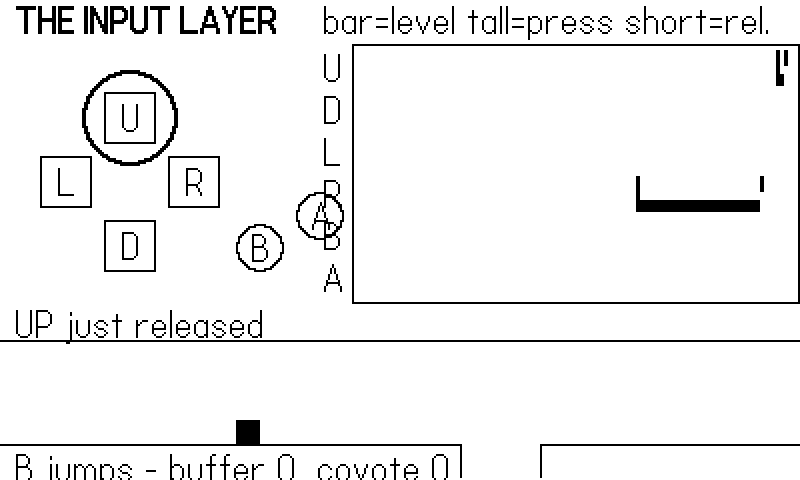
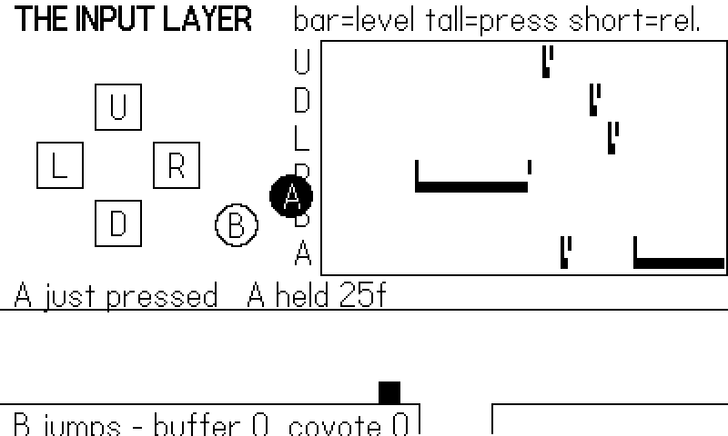
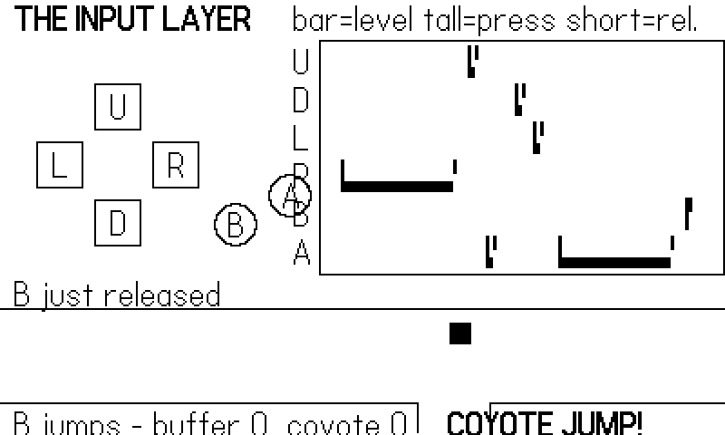
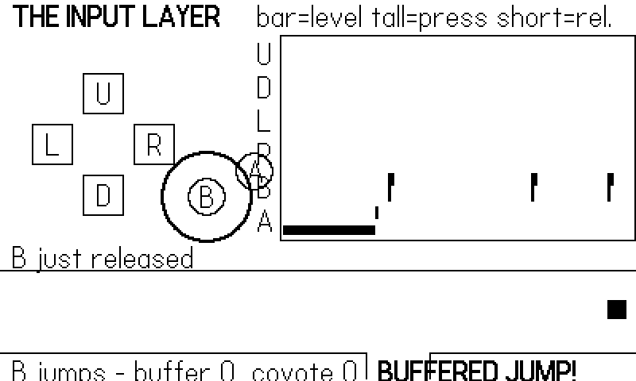

# Buttons: The Input Layer {#sec-input}

The Playdate gives you eight physical inputs: a four-way d-pad, two
face buttons, a crank, and (buried in the console body) an
accelerometer. This chapter is about the six buttons — not because
they are complicated, but because how you *read* them decides how
your whole game is structured. Get the input layer right and every
later chapter gets easier: your game becomes testable by a robot,
your controls become tunable in one file, and subtle feel problems
like eaten jump presses simply stop happening.

The chapter's example is an input visualizer: a set of on-screen
lamps mirroring the real buttons, a logic-analyzer-style trace that
separates *level* from *edge* — the one distinction that matters —
and, along the bottom, a tiny auto-runner that demonstrates the two
classic input-feel tricks, jump buffering and coyote time. The whole
thing is driven by a scripted thumb rather than a human one, which
is not a gimmick: it is the exact seam that all sixty of the shipped
games in this book's pedigree use for their autopilots, and the one
Chapter 18 turns into a full test harness.

You will leave this chapter with a reusable `Input.gather()` module
and a working intuition for when a button state is a fact ("A is
down") and when it is an event ("A *went* down").

## Six buttons, two questions

Every button API in the SDK answers one of two questions. The first
is about **level**: is the button down *right now*?

```lua
if playdate.buttonIsPressed(playdate.kButtonRight) then
    x = x + speed * DT   -- runs every frame the button is held
end
```

The second is about **edge**: did the button *change* this frame?

```lua
if playdate.buttonJustPressed(playdate.kButtonA) then
    jump()               -- runs once per physical press
end
```

`playdate.buttonIsPressed(button)` returns true on every update
while the button is held. `playdate.buttonJustPressed(button)`
returns true for exactly one update cycle when the button goes
down, and will not fire again until the button is released and
pressed again. Its mirror image, `playdate.buttonJustReleased
(button)`, returns true for one update when the button comes up —
that one is how "release to fire" mechanics work, and we will lean
on it in the crank chapter's wind-and-release demo.

All three take one of six constants:

| Constant | Button |
|---|---|
| `playdate.kButtonUp` | d-pad up |
| `playdate.kButtonDown` | d-pad down |
| `playdate.kButtonLeft` | d-pad left |
| `playdate.kButtonRight` | d-pad right |
| `playdate.kButtonA` | A |
| `playdate.kButtonB` | B |

The SDK also accepts the strings `"a"`, `"b"`, `"up"`, `"down"`,
`"left"`, and `"right"` in place of the constants. Use the
constants: they are bitmask values, so a typo'd constant is a `nil`
that errors immediately, while a typo'd string fails silently.

::: {.callout-note}
## Everything at once: getButtonState
`playdate.getButtonState()` returns three bitmasks — `current`,
`pressed`, `released` — covering all six buttons in one call. If
the d-pad left and A are both down, `current` is
`playdate.kButtonA | playdate.kButtonLeft`. It is occasionally
handy for serializing input (a replay system can store one integer
per frame), but for readable game code the per-button predicates
are better.
:::

Level and edge sound interchangeable until you wire a jump to the
wrong one. Wire `jump()` to `buttonIsPressed` and your character
machine-guns off the floor thirty times a second while A is held.
Wire *movement* to `buttonJustPressed` and the player has to
hammer the d-pad like a woodpecker to cross the screen. The rule:
**continuous actions read levels, discrete actions read edges.**
Clam Jumper's input table (quoted later in this chapter) shows both
side by side on the same A button: the octopus dash *triggers* on
the edge, but the ray's glide *sustains* on the level.

## Spending six buttons well

Six inputs is not many, and the platform has conventions worth
respecting before you spend them. **A is the primary verb** —
confirm in menus, the main action in play. **B is the secondary
verb and always "back"** in any menu context; a Playdate player's
thumb goes to B to retreat without reading your screen. The d-pad
is movement or cursor, and diagonals are physically awkward on the
device's small cross, which is why grid games collapse the axes —
Clam Jumper's "vertical wins ties" line below is that decision in
code. If you need more verbs than buttons, the standard tricks
apply in this order of preference: context-sensitivity (A does the
one thing that makes sense here), hold-versus-tap on the same
button (an edge starts a charge, the release fires — Chapter 10's
lob panel), and only then chords like B+A, which players discover
last and forget first.

Two presentation details save you real confusion. First, when your
HUD or tutorial text names a button, use the circled glyphs — the
system font renders `Ⓐ` and `Ⓑ` correctly, and they read
instantly. Second, know the font's holes before you decorate.

::: {.callout-warning}
## Glyphs the system font does not have
The system font is missing more characters than you expect:
mid-dot `·` and em-dash `—` both render as error boxes, a bug
that reliably ships because everything looks fine in your editor.
The `Ⓐ` and `Ⓑ` button glyphs *do* work. When a label looks wrong
on device or Simulator, suspect the character set before your
drawing code — and prefer plain hyphens and spaces in HUD strings,
as this chapter's example does.
:::

## Seeing the difference

The example makes the distinction visible. Lamps on the left mirror
the d-pad, B, and A; every press edge spawns an expanding ring
around its lamp for eight frames. On the right, a trace scrolls the
last 110 frames of history like a logic analyzer: a low bar while a
button's level is high, a full-height tick at each press edge, and
a short tick at each release edge.



@fig-input-edge is the frame A went down: the lamp fills *and* the
ring flares, and the caption line reports the edge. Twenty-six
frames into a hold (@fig-input-held) the lamp is still lit —
`buttonIsPressed` is still true — but there is no ring and no edge:
`buttonJustPressed` returned true exactly once, back at the press.

{#fig-input-edge}

{#fig-input-held}

The trace in @fig-input-trace tells the same story horizontally.
Held right on the d-pad is a thirty-frame bar bracketed by one
press tick and one release tick; the two-frame taps are almost all
tick and no bar. When an input bug has you baffled, five minutes of
building a trace like this one pays for itself — it turns "the jump
sometimes doesn't fire" into "the press edge lands on the frame we
were still in the pause menu."

{#fig-input-trace}

## Polling versus input handlers

Everything above **polls**: each update asks the SDK for the state
it cares about. The SDK also offers a push model,
`playdate.inputHandlers`, in which you hand over a table of
callbacks and the OS calls you:

```lua
-- anti-pattern for a game loop; fine for modal UI (see text)
local handlers = {
    AButtonDown = function() Menu.confirm() end,
    upButtonDown = function() Menu.move(-1) end,
    downButtonDown = function() Menu.move(1) end,
    cranked = function(change, accelChange)
        Menu.scroll(change)
    end,
}
playdate.inputHandlers.push(handlers, true)
-- ... later, when the menu closes:
playdate.inputHandlers.pop()
```

A handler table is a plain Lua table — no subclassing — with any of
the callbacks `AButtonDown`/`AButtonHeld`/`AButtonUp` (likewise for
B), `upButtonDown`/`upButtonUp` (likewise for the other d-pad
directions), and `cranked(change, acceleratedChange)`. Handlers
stack: `push` adds a table, `pop` removes it, and input propagates
down the stack to the first table that defines a given callback.
The second argument to `push`, `masksPreviousHandlers`, stops that
propagation — pass `true` and any callback you *didn't* define is
simply dropped instead of falling through to the handlers (and the
default `playdate` table) below.

That stacking is the feature. Input handlers are built for
**temporarily stealing focus**: a pause overlay, a text prompt, a
shop screen that must not leak d-pad presses into the game
underneath. Push a masking handler when the overlay opens, pop it
when it closes, and the game code under it needs no `if menuOpen`
guards at all.

Walk the scenario through. Your game polls in `playdate.update`.
The player opens your in-game shop; you push the shop's handler
table with `masksPreviousHandlers = true`. From that frame, the
shop's `upButtonDown` fires on d-pad presses, the callbacks you
did not define are swallowed rather than falling through — and,
crucially, the *polling* functions keep answering honestly, so a
game loop that still calls `buttonIsPressed` will see presses the
handler already acted on. That is the one integration trap: the
two models do not lock each other out. If you mix them, gate your
polling on "is anything pushed above me," or better, do not mix
them — pause your simulation while an overlay owns the stack, and
resume it on `pop`.

For the core game loop, though, the sixty shipped games this book
draws on poll — every one of them. Two reasons. First,
determinism: a poll happens at a known point in *your* frame, so
game logic sees one coherent input state; callbacks arrive whenever
the OS pleases, which invites half-updated-state bugs. Second, and
decisive for this book: a polling loop has one narrow place where
input enters the game, and one narrow place is exactly what you
need to replace a human with a script.

::: {.callout-warning}
## Missed presses at low frame rates
Both models sample between updates. If your game dips below its
target frame rate, a fast tap can go down *and* up inside one long
frame — `buttonJustPressed` still catches that (the press is
latched for the next update), but two taps in one frame collapse
into one. If that matters (rhythm games, mash mechanics), see
`playdate.setButtonQueueSize(size)`, which queues button events
instead of coalescing them. At a steady 30 fps you will not need
it.
:::

## One snapshot per frame: Input.gather()

Here is the pattern the whole book builds on. The example's
`input.lua` maps logical names to buttons:



and exposes a single function that produces **one snapshot table
per frame**:



Read the first line again, because it is the most important line in
the chapter: `Harness.input(frame)` returns a table of synthetic
button levels when a script is driving (in this book's builds, the
`shots.lua` figure script; in a shipped game, an autopilot), and
`nil` when a human is playing. The bot is consulted *first*, and it
feeds the *same fields* the human path fills. Everything downstream
— game logic, the visualizer, the runner — consumes the snapshot
and cannot tell the difference.

Note what the snapshot does about edges: it derives them, `level
now and not level last frame`. For a human we could have called
`buttonJustPressed` instead — it computes exactly that — but the
bot only supplies levels, and deriving edges in one place means
scripted input gets `aJust` for free. That is the entire mechanism
by which a ten-line figure script can "press" buttons.

The game loop then consumes the snapshot:



Three properties make this pattern worth the small ceremony:

- **One read per frame.** Every consumer sees the same input; no
  mode handler can double-handle an edge another already consumed,
  and no code path reads a button the frame after another path
  acted on it.
- **One vocabulary.** Game code says `s.aJust`, not
  `playdate.buttonJustPressed(playdate.kButtonA)`. Rebinding
  controls (or supporting both B-jump and A-jump) is a one-file
  edit.
- **One injection point.** A test script, a demo-mode attract
  loop, and a debugging "replay last 300 frames" tool are all the
  same five lines.

This is the seam Chapter 18 drives a truck through: the harness
that captured every figure in this book is nothing more than a
`Harness.input` that reads from a script instead of returning
`nil`.

### Case study: Clam Jumper's input table

Clam Jumper — a port of the 1982 arcade game *Claim Jumper* to an
ocean floor — needs both kinds of button read on the *same* button,
which makes its `Input.gather` a compact tour of everything above:

```lua
-- clamjumper/source/input.lua:15
    if playdate.buttonIsPressed(playdate.kButtonLeft) then mvx = -1 end
    if playdate.buttonIsPressed(playdate.kButtonRight) then mvx = 1 end
    if playdate.buttonIsPressed(playdate.kButtonUp) then mvy = -1 end
    if playdate.buttonIsPressed(playdate.kButtonDown) then mvy = 1 end
    -- one axis at a time on a grid; vertical wins ties
    if mvy ~= 0 then mvx = 0 end
    return {
        mvx = mvx, mvy = mvy,
        ability = playdate.buttonJustPressed(playdate.kButtonA),
        abilityHeld = playdate.buttonIsPressed(playdate.kButtonA),
        crank = playdate.getCrankChange(),
    }
end
```

Movement is levels, collapsed to a grid direction. The species
ability is *two fields from one button*: `ability` is the edge (the
sea star's clamp and the octopus's dash trigger once), while
`abilityHeld` is the level (the ray keeps gliding only while A
stays down). And directly above this code — lines 11–13 of the
file — sits the seam: `if Harness.enabled and Harness.autopilot
then return Harness.autopilot() end`. The autopilot that
smoke-tested all three species returns this same table shape,
`ability` edges and all, exactly as our `bot` does.

The same file holds one more pattern worth stealing: alongside the
main `Input.gather()`, it exports tiny per-context helpers —
`Input.confirm()` for "advance this screen" and `Input.menuLR()`
for the species-select cursor. Title screens and menus want a
*different, smaller* vocabulary than gameplay, and giving them
their own two-line functions keeps the gameplay snapshot from
growing `confirm`/`menuMove` fields that only matter two seconds
per session. Note that `Input.confirm()` carries its own bot
branch (`if Harness.enabled then return G.t > 0.7 end` — "the bot
confirms any screen after 0.7 seconds"), so even the title screen
is scriptable. Every input entry point gets a seam, or the robot
gets stuck at the first "PRESS A" it meets.

## Buffering and coyote time

Edges give you *correct* input. Two small tricks give you *kind*
input. Both live in the runner strip along the bottom of the
example, and both are forgiveness windows measured in frames:

- **Input buffering**: the player presses jump a few frames
  *before* landing. A literal engine drops the press — the
  character was airborne, jumping was illegal — and the player
  swears they pressed the button. A buffered engine remembers the
  press briefly and fires it the instant landing makes it legal.
- **Coyote time**: the player presses jump a few frames *after*
  running off a ledge, like Wile E. Coyote treading air. A literal
  engine says "not grounded, no jump" and the player falls,
  cheated. A forgiving engine keeps the jump legal for a handful of
  frames past the edge.

The implementation is two countdown timers:



Walk through the press branch. On a `bJust` edge: if grounded,
jump — the normal case. If airborne but the coyote clock is still
running, jump anyway; the clock only starts when the runner *walks*
off a ledge (the `wasGrounded and vy > 0` branch — a jump must not
grant a second jump). Otherwise the press was genuinely too early,
so it is *remembered* in `bufferT` instead of dropped, and the
landing code flushes it. Six frames is a fifth of a second at 30
fps: generous enough to absorb human timing error, tight enough
that nobody perceives the game acting on its own.

@fig-input-coyote catches the coyote case: the runner is over the
pit, already past the ledge, and the jump still fired.
@fig-input-buffer is the buffered press: B went down four frames
before touchdown (you can find the tick on the trace), and the
runner is rising again on the very frame it landed.

{#fig-input-coyote}

{#fig-input-buffer}

::: {.callout-warning}
## Forgiveness must not stack into cheating
Clear both timers whenever a jump fires (`jump()` zeroes them
above). If you forget, a buffered press can fire on landing *and*
leave a live coyote window, letting a pressed-once player jump
twice. Symmetrically, only start the coyote clock on a
*walk-off* — gating it on `vy > 0` with `wasGrounded` is what
stops a rising jump from re-arming it.
:::

How wide should the windows be? There is no universal number, but
the shipped games cluster tightly, and the reasoning generalizes:

| Window | Frames at 30 fps | Why |
|---|---|---|
| Jump buffer | 4–8 | absorbs thumb-early error; above ~10 the game visibly acts "on its own" |
| Coyote time | 4–8 | covers the eye's lag noticing the ledge; above ~10 jumps look airborne |
| Hold-vs-tap split | 8–12 | below ~8, deliberate taps register as holds |

Tune them as `<const>` frame counts, not seconds — they are feel
constants pinned to your fixed 30 fps timestep, and expressing
them in frames keeps them honest when you read a trace. And if a
tester says your jump "feels unresponsive" while your input code
is provably correct, widen these before touching anything else;
nine times out of ten the physics is fine and the forgiveness is
missing.

Neither trick requires the snapshot pattern, but notice how cheap
they became on top of it: `Runner.update(s)` reads `s.bJust` and
never touches the SDK, so the scripted thumb in `shots.lua`
exercised both forgiveness windows — and the figures prove they
work — without the Simulator's keyboard ever being touched.

## The scripted thumb

For completeness, here is the entire script that drove every figure
in this chapter — the `Shots` table's `script` function is called
once per frame and returns the bot table that `Input.gather` reads:



Holds are frame ranges, taps are one- or two-frame ranges, and the
three B presses at 105, 150, and 174 are aimed at the runner: one
inside the coyote window just past the ledge, one plain jump on
flat ground, and one four frames before a landing so it buffers.

Aiming a press at frame 174 only works because the whole run is
**deterministic**: the RNG is seeded (`seed = 1`), the script is
indexed by frame number rather than wall-clock time, and the
runner's physics is a pure function of its inputs. That discipline
is why the harness can run the game unthrottled — hundreds of
frames a second — and the presses still land on the same frames.
Determinism is also what makes the counters meaningful: the code
in this chapter calls `Harness.count("coyote jump")` and friends
at each interesting event, and the harness folds those tallies
into a heartbeat file a test script can grep.

When you build your own games on this pattern (and Chapter 18
will insist), scripts like this become your regression suite: if
a refactor breaks coyote time, the `"coyote jump"` counter drops
to zero on the next scripted run and the failure is caught before
any human notices anything. The shipped games learned to count
*everything* — shots, kills, deaths, mode changes — because a
missing counter in the heartbeat is the fastest bug signal there
is.

## What you know now

- `buttonIsPressed` reads a **level** (continuous actions);
  `buttonJustPressed`/`buttonJustReleased` read an **edge**
  (discrete actions). An edge is just "level now, not level last
  frame."
- The six `playdate.kButton*` constants name the buttons;
  `getButtonState()` returns all of them as bitmasks.
- `playdate.inputHandlers.push/pop` is a callback stack made for
  modal focus-stealing; the game loop itself should poll.
- `Input.gather()` builds **one snapshot table per frame**, with
  the bot consulted first — the injection seam every shipped game
  uses and Chapter 18 industrializes.
- Jump buffering remembers early presses; coyote time honors late
  ones; both are little countdown timers, and both must be cleared
  when the jump fires.

Next: the input device no other handheld has. The crank gets a
chapter of its own — absolute position, deltas, detents, and the
catalog of mappings that sixty games proved fun.
