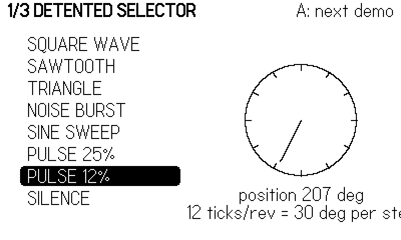
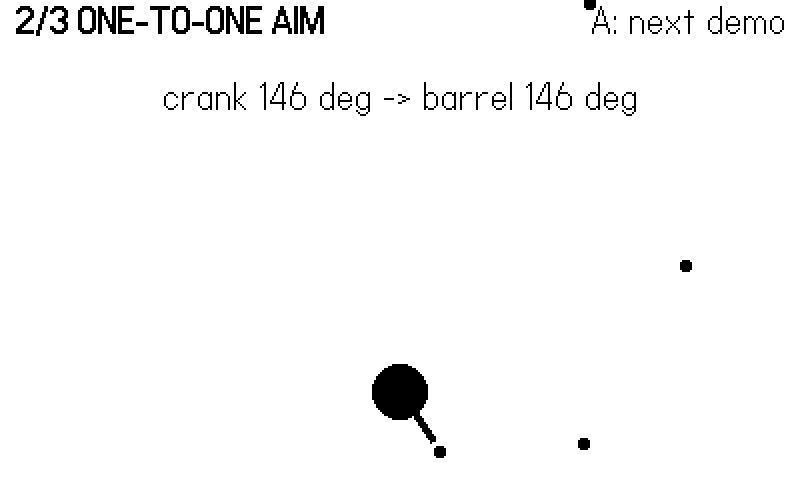
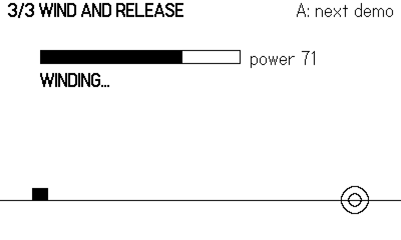
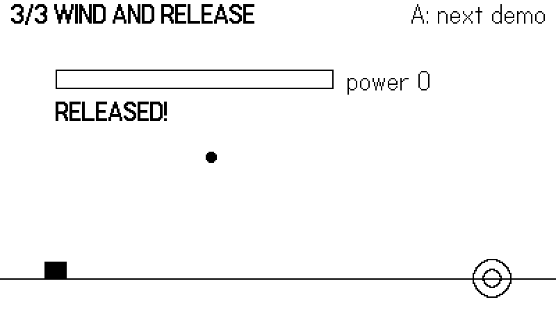
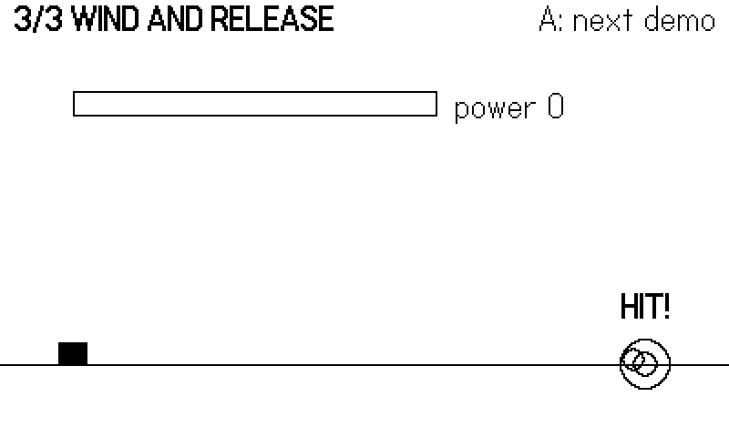

# The Crank {#sec-crank}

No other console has one. The crank is a fold-out handle on the
Playdate's right edge that rotates freely, forever, in either
direction — no stops, no detents, no spring. Mechanically it is a
high-resolution rotary encoder; ergonomically it is a fishing reel,
a pepper mill, a safe dial, a winch, and a steering wheel,
depending entirely on the mapping you write. That mapping is a real
design decision: the same hardware that feels *wonderful* reeling
in a fish feels *terrible* steering a spaceship if you map it
wrong, and this chapter ends with a catalog of mappings that sixty
shipped games proved out so you can start from ones that work.

The API surface is small — three read functions, a dock sensor, two
callbacks, and one stock UI widget — but the three read functions
answer three genuinely different questions, and picking the wrong
one is the classic crank bug. This chapter's example puts all three
side by side in one pdx: a **detented selector** built on
`getCrankTicks`, a **1:1 aim turret** built on `getCrankPosition`,
and a **wind-and-release lob** built on `getCrankChange`, cycled
with the A button. As always, a scripted wrist drives the figures,
which forces us to solve a real problem — how do you fake a crank? —
that turns out to teach the API more deeply than reading it ever
would.

## Three questions, three functions

**Where is the crank?** `playdate.getCrankPosition()` returns the
absolute position in degrees, 0 to 359.9999, where **zero is the
crank pointing straight up** and clockwise rotation (viewed from
the device's right edge) increases the angle. Absolute position is
for mappings where the handle *is* a physical thing in the game: a
turret barrel, a clock hand, a mortar's elevation.

**How much did it move?** `playdate.getCrankChange()` returns the
signed delta in degrees since the last call — positive clockwise,
negative anti-clockwise. It actually returns *two* values:

```lua
local change, acceleratedChange = playdate.getCrankChange()
```

`acceleratedChange` is the same delta multiplied by a speed-
dependent factor, like mouse acceleration: slow cranking passes
through nearly 1:1, fast cranking is amplified. Use it for scroll
views and long lists where a player spinning hard means "get me to
the end," and plain `change` for anything physical, where
acceleration would break the machine metaphor.

**How many notches did it click past?** `playdate.getCrankTicks
(ticksPerRevolution)` quantizes rotation into discrete ticks —
pass 12 and you get one tick per 30 degrees, returned as a signed
count (usually 0 or ±1 per frame) as boundaries are crossed. Tick
boundaries sit at *fixed absolute angles*, not at
wherever-you-started, so twelve ticks land on the same twelve
clock positions every revolution. Ticks are for menus, item
wheels, and anything that should feel like a ratchet.

::: {.callout-warning}
## getCrankTicks requires CoreLibs/crank
`getCrankPosition` and `getCrankChange` are core API, always
present. `getCrankTicks` is **not** — it is defined in
`CoreLibs/crank`, and without `import "CoreLibs/crank"` the call
is an attempt to call a `nil` value that crashes at runtime, not
compile time, on the first frame that reads it. Fightin' Chitin
was burned by exactly this in an early build; its fighter-select
screen still carries the scar tissue, guarding the call so the
screen survives even if the import goes missing:

```lua
-- chitin/source/select.lua:72
    local ticks = playdate.getCrankTicks and playdate.getCrankTicks(12) or 0
    if ticks ~= 0 then move = ticks > 0 and 1 or -1 end
```

Import the CoreLib and you will not need the guard; the example's
`main.lua` imports it right at the top with a comment saying why.
:::

One more sharp corner: **each of these functions consumes its own
delta**. `getCrankChange` reports movement "since the last time
this function (or the `playdate.cranked()` callback) was called,"
and `getCrankTicks` likewise counts from its own last call. Call
either from two places in the same frame and each call sees only
part of the motion. The classic symptom is a scroll view that
moves at half speed after you add a second feature that "also just
peeks at the crank." The cure is the Chapter 9 discipline: read
the crank **once** per frame into the input snapshot, and let
everyone consume the snapshot.

### The push model: cranked()

Like the buttons, the crank also speaks the callback dialect.
Define `playdate.cranked(change, acceleratedChange)` and the OS
calls you with the same two values `getCrankChange` returns; a
`cranked` entry in an input-handler table (Chapter 9) does the
same, and stacks and masks like every other handler callback.
This matters for exactly the situation input handlers exist for:
a modal overlay that scrolls with the crank must *own* the crank
while it is up, and a masking handler with a `cranked` function
does that cleanly — remember that the callback consumes the same
delta as `getCrankChange`, which is precisely what you want, since
the game's poll then correctly sees nothing while the overlay
eats the rotation. For the core loop, poll; the reasons from
Chapter 9 apply unchanged.

## Docked, undocked, and the indicator

The crank folds flat into the console body, and the OS can tell.
`playdate.isCrankDocked()` polls the state; the optional callbacks
`playdate.crankDocked()` and `playdate.crankUndocked()` fire on
the transitions. The docking action plays a stock sound effect,
which `playdate.setCrankSoundsDisabled(true)` suppresses if your
game has its own foley (it re-enables automatically when your game
exits).

Dock state is design input. A docked crank means the player is
holding the machine like a Game Boy; an undocked crank means one
thumb has left the buttons. Games that make the crank optional
poll `isCrankDocked()` and swap control schemes — Lob aims with
the crank when it is out and falls back to d-pad rotation when it
is stowed.

When the crank is *required*, tell the player with the system's
own widget. `playdate.ui.crankIndicator` (import `CoreLibs/ui`)
draws the standard "use the crank" toast at the lower right: call
`playdate.ui.crankIndicator:draw()` every frame you want it shown
— typically `if playdate.isCrankDocked()` — and it animates a
"Use the crank" message for about 0.7 seconds, then a rotating
crank for about 1.4, looping. Stop calling `:draw()` and it is
gone. The `.clockwise` boolean property flips the animation
direction, and `:resetAnimation()` restarts the sequence; there is
nothing to instantiate — the shared instance is the object. The
example wires it exactly this way in its update loop, so on a real
device the demo nags until the handle comes out.

## The example: three mappings, one handle

Everything the crank does in this chapter flows through one
snapshot function, extending the Chapter 9 pattern:



The human path is three SDK calls plus the dock poll. The bot path
is where scripting a crank gets interesting: the figure script
supplies a per-frame *delta* (`bot.crank`, in degrees), and the
snapshot integrates it into an absolute position — so `pos`,
`change`, and `ticks` stay mutually consistent, exactly as they are
for hardware. Ticks are derived with the SDK's own fixed-boundary
rule:



Twelve lines to emulate the encoder, and in exchange the panels
below run identically under a script or a hand. Why integrate
deltas instead of letting the script set positions directly?
Consistency: real hardware never teleports, and code you write
against `pos` and `change` should never see them disagree. A
script that says "8 degrees a frame for 50 frames" is also a
*physical* description — you can feel your wrist doing it — which
keeps scripted runs honest about what a player can actually
perform. The panels count their interesting events
(`Harness.count("detents")`, `"tracers"`, `"lobs"`, `"hits"`)
so a scripted run does not just produce figures, it asserts
behavior: a refactor that breaks tick derivation zeroes the
detent counter on the next run.

The A button cycles the three panels:



### Panel 1: the detented selector



`s.ticks` is almost always 0, occasionally ±1, so the selection
walks one item per 30-degree click, wrapping with the usual
`(i - 1 + n) % n + 1` modular dance. The six-frame `flash`
thickens the dial needle after each click — a tiny visual detent
to stand in for the mechanical one the hardware doesn't have.
@fig-crank-detent catches the flash mid-click, with the on-screen
dial showing the twelve boundary notches the ticks snap to.

{#fig-crank-detent}

Detents are the right mapping whenever the underlying value is
discrete. The player never has to *aim* — overshoot by 14 degrees
and nothing happens; the ratchet only speaks at the boundaries.

### Panel 2: one-to-one aim



One line of mapping: `angle = rad(pos - 90)`. The `- 90` converts
crank-zero (straight up, toward the sky) into screen coordinates,
where an angle of zero points right; with it, crank-up means
barrel-up, and the handle becomes the barrel. The turret fires a
tracer every ten frames so the figure shows where it points
(@fig-crank-aim).

{#fig-crank-aim}

This is the crank at its most transparent, and Lob — a voxel
artillery duel — ships exactly this line, plus the dock-state
fallback from the previous section:

```lua
-- voxel/games/lob/input.lua:26
    local pd = playdate
    s.aim = nil
    if not pd.isCrankDocked() then
        -- crank up = aim away from the viewer
        s.aim = math.rad(pd.getCrankPosition() - 90)
    end
```

`nil` when docked, an angle when not: downstream code treats "the
player is aiming" and "the player has stowed the crank" as
different inputs, not different *values*, and the d-pad fallback
fills in only in the first case.

### Panel 3: wind and release



The third mapping treats cranking as *effort*. Forward motion
pumps the power meter (`change * 0.25`, capped at 100); the
moment the crank goes still for five frames, the stored power
releases as a lobbed shell whose velocity scales with the meter.
The player physically winds up a throw and lets go — no button
involved. @fig-crank-wind shows the meter filling under hard
cranking; @fig-crank-release the shell in flight after the hands
came off; and @fig-crank-hit the payoff, a full-power shot
splashing onto the target ring.

{#fig-crank-wind}

{#fig-crank-release}

{#fig-crank-hit}

::: {.callout-note}
## Why "went still" and not "A to fire"?
Because release *is* the verb. Wind-and-release lives or dies on
the wind-up being the whole gesture; adding a button turns a
throw back into a menu. Playtesting across Lob and Bulwark
settled a refinement, though: players like aiming on the crank
and confirming power with a **held-A oscillating meter** when the
two must combine — one hand per concern. If your design needs
aim *and* power on one crank, steal that split rather than
overloading the handle with both.
:::

## Degrees are not game units

Every crank mapping ends with a multiplication, and that constant
deserves more respect than it usually gets. A few rules from the
tuning trenches:

**Gear it deliberately.** The wrist turns comfortably at roughly
one revolution per second, in bursts. If one revolution of the
crank should reel in one meter of fishing line, your constant is
`meters = change / 360` — and now "how fast can the player reel"
is a physical fact you can design around rather than an accident
of a magic number. State the gearing in real terms in a comment
(`-- 90 deg of crank = one ladder rung`) and tuning sessions stop
being guesswork.

**Deltas need no DT.** A per-frame `change` is already "degrees
this frame" — physical motion, sampled. Multiplying it by `DT`
double-applies time and makes crank speed depend on frame rate.
Compare the two terms in Gyre's mixer, quoted below: the crank
delta passes straight through, while the *d-pad* term — a
per-second rate — is the one multiplied by `C.DT`.

**Clamp arcs for dials.** A throttle or volume knob should not
wrap from full to zero as the crank crosses its top. Either
accumulate deltas into a clamped value (a "virtual dial" that
simply stops accepting input at its ends), or if you map absolute
position, pick an arc well away from 0/360 so normal use never
crosses the seam. Herd's release-rate dial is a clamped
accumulator; the players who tested it never noticed — which is
the point.

**Respect direction.** Clockwise-when-viewed-from-the-right is
"forward"/"in"/"up" in most players' intuition (reeling, winding,
throttling up). If your mapping feels backward in testing, negate
the constant rather than asking players to adapt — one changed
sign beats a tutorial sentence.

## A catalog of proven mappings

Sixty games in, these are the crank mappings that survived play,
with a shipped reference for each. Steal freely.

| Mapping | Read | Feels like | Proven in |
|---|---|---|---|
| 1:1 rotation/aim | `getCrankPosition` | the handle is the object | Asteroids-style ships, Rubble, Lob |
| Wind-and-release power | `getCrankChange` | a throw, a catapult | Lob, Bulwark |
| Spring/boost charge | `getCrankChange` | cocking a spring | Crumble, Marble |
| Detented selection | `getCrankTicks` | a ratchet, a rotary phone | Bulwark piece rotation, Chitin select |
| Rate dial / throttle | `getCrankPosition` (as a knob) | a volume knob | Herd's release-rate dial |
| Crank-as-velocity | `getCrankChange` | stirring the world | Gyre |
| Paddle / steering | `getCrankChange` or position | Pong knob, a wheel | paddle and steering prototypes |
| Fuse / timer length | `getCrankTicks` | setting an egg timer | fuse-length tuning |

The last untried-looking entry, crank-as-velocity, deserves its
quote. Gyre is a Gyruss-style tube shooter in which the ship rides
a ring around the screen edge, and its entire movement model is
one line — the crank's delta *is* the ship's angular velocity:

```lua
-- phosphor/games/gyre/input.lua:79
    local move = playdate.getCrankChange()
    if playdate.buttonIsPressed(playdate.kButtonLeft) then
        move = move + C.DPAD_DEG_PER_SEC * C.DT
    end
```

Crank fast, orbit fast; stop, stop. No tuning constant ever felt
as direct as the raw delta — the crank IS the ship. (Note the
d-pad *additively* mixed in as a fallback, in the same snapshot,
so a docked-crank player is never stranded.)

Two rules of thumb fall out of the catalog. First, match the
verb's *physics*: continuous world quantities map to `change`,
positional things map to `position`, discrete choices map to
`ticks` — misassign these and the handle fights the player's
wrist. Second, respect fatigue: cranking is more muscle than a
thumbstick, so mappings that demand sustained fast rotation
(velocity, winding) need sessions measured in seconds, while
position and detent mappings, which are nearly effortless, can
run a whole game.

## The scripted wrist

As in Chapter 9, every figure came from a script — this time a
wrist rather than a thumb:



Read it as choreography. A slow 3-degrees-per-frame crawl through
the selector is 270 degrees over 90 frames — nine detent clicks,
each of which must move the list exactly one row or the `detents`
counter betrays the bug. The turret's 4-degree sweep puts the
barrel at a photogenic 150 degrees on the shot frame, with tracers
from the preceding half-revolution still in flight. And the lob
panel's timeline is the mechanic itself, spelled out in frames:
wind hard until 235, go still, release fires five quiet frames
later, and the shell's whole ballistic arc — including the
touchdown on the target at ~296 — follows deterministically from
the release velocity. The comment block at the top of the file
records those expected beats, which is a habit worth copying:
when a run's figures come out wrong, the script's own comments
say what *should* have happened on which frame.

## What you know now

- `getCrankPosition()` = absolute degrees, 0 = straight up;
  `getCrankChange()` = signed delta plus an accelerated second
  return; `getCrankTicks(n)` = fixed-boundary detents — and it
  lives in `CoreLibs/crank`, crashing at runtime without the
  import.
- Deltas are consumed per call: read the crank once per frame into
  the input snapshot.
- `isCrankDocked()` plus the `crankDocked`/`crankUndocked`
  callbacks let you swap control schemes;
  `playdate.ui.crankIndicator:draw()` (CoreLibs/ui) is the stock
  "use the crank" nag.
- A scripted crank is an integrated delta: feed deltas, derive
  position and ticks, and the same panel code serves script and
  hand.
- Match mapping to verb — position for aim, change for effort and
  velocity, ticks for choices — and budget the player's wrist.

Next: the input you cannot see. The accelerometer, the System Menu,
the keyboard, and the rest of the system UI — everything your game
does when it is not strictly playing.
