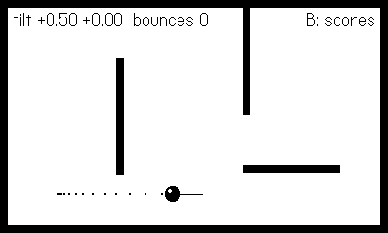
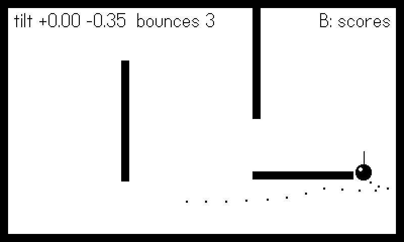
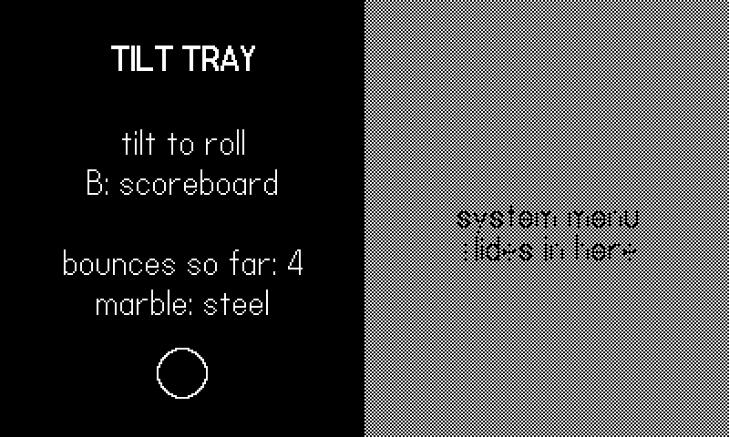

# Tilt, Menus, and System UI {#sec-tilt}

Three inputs remain, and none of them is a button. The
accelerometer turns the whole console into a controller — tilt the
machine and a marble rolls. The System Menu is the one piece of UI
the OS owns inside your game, and it hands you exactly three
custom slots plus a half-screen billboard. And when you need a
string from the player, the system keyboard takes the stage. Around
all of these sit the lifecycle callbacks — pause, resume,
terminate, sleep, lock — that separate a polished game from one
that loses your save when the battery dies.

This chapter's example is a toy with all of it wired in: a steel
marble rolling around a walled tray under accelerometer control,
three System Menu items (an action, a checkmark, an options
cycler), a procedurally drawn pause card, and a
`playdate.ui.gridview` scoreboard that flips in on the B button,
saved through the datastore by the lifecycle callbacks. The tilt
case study is Bearing, a shipped marble-maze game whose
calibration and scripted-tilt patterns this example distills.

One honest warning up front: this is the chapter where headless
figures get interesting. The Simulator's accelerometer reads the
tilt sliders in its own window, which no script of ours moves, and
the real pause screen belongs to the OS, which no headless
screenshot can capture. Both problems fall to the same seam we
have used since Chapter 9 — and watching them fall is half the
lesson.

## The accelerometer

The accelerometer is off by default (it costs a little power).
Turn it on once, then read it each frame:

```lua
playdate.startAccelerometer()
-- ...one update later...
local x, y, z = playdate.readAccelerometer()
```

`readAccelerometer()` returns the gravity vector in units of *g*:
`x` positive toward the device's right edge, `y` positive toward
the bottom of the screen, `z` positive out the back of the device.
Held upright it reads (0, 1, 0); flat on a table, (0, 0, 1). For a
tilt-controlled game on a face-up device, `x` and `y` are simply
"how much downhill is that way" — which is why the marble code
below can feed them straight into acceleration.
`playdate.stopAccelerometer()` powers it back down when you leave
the tilt mode, and `playdate.accelerometerIsRunning()` tells you
where you stand.

::: {.callout-warning}
## Two accelerometer traps
First, timing: the hardware needs an update cycle after
`startAccelerometer()` before values are valid, so start it at
boot (as the example does), not in the same frame you first read
it — and guard the read (`x or 0`) so a `nil` from a not-yet- or
never-started accelerometer cannot poison your math. Second, the
Simulator: `readAccelerometer()` there reports the **window's
tilt controls**, not your MacBook's orientation. Fine for hand
testing; useless for scripts, which is what the seam below is
for.
:::

### Reading tilt through the seam

Here is the example's entire tilt pipeline — bot first, hardware
second, then smoothing and calibration:



Three layers, each earning its place:

**The seam.** A headless run cannot tilt the Simulator, so the
figure script supplies `bot.tiltX`/`bot.tiltY` through
`Harness.input`, exactly as Chapter 9's script supplied button
levels. (A Lua footnote makes the `or`-chain safe here: `0` is
*truthy* in Lua — only `nil` and `false` fall through — so a bot
tilt of exactly zero still short-circuits and never falls back to
the hardware read.)

**The low-pass filter.** Raw accelerometer samples jitter — hand
tremor, sensor noise, the odd bump. Blending 20% of each new
reading into a running value (`smooth = smooth + (raw - smooth) *
0.2`) is a one-line low-pass filter: jitter above a few hertz
averages away, deliberate tilts pass through with a few frames of
lag. Raise the `0.2` toward `1` for responsiveness, lower it for
calm; 0.2 at 30 fps is a good marble.

**The calibration offset.** Nobody plays a Playdate dead flat —
players hold it tilted back at whatever angle their couch
dictates. If you treat raw (0, 0) as neutral, every player starts
with the marble sliding toward their lap. So the game records the
smoothed reading at a known moment as `zeroX, zeroY` — "this is
what *this* player's flat feels like" — and reports tilt relative
to that. The example calibrates at boot, from a System Menu item,
and (a detail worth stealing) in `gameWillResume`, because hands
always shift while a menu is open.

Two smaller accelerometer patterns round out the toolbox. **Shake
detection** needs no new API: at rest the vector's magnitude is
1 *g*, so `math.sqrt(x*x + y*y + z*z) - 1` measures how hard the
device is being jostled, and a threshold of around 0.5 sustained
for a couple of frames is a serviceable "shake to shuffle." Use
the *raw* reading for this, not the smoothed one — the low-pass
filter exists precisely to erase the signal a shake detector
wants. And **turn it off when you leave the tilt mode**: the
power cost is small, but `stopAccelerometer()` in your mode-exit
path is free, and a stopped accelerometer makes stale reads fail
loudly (`nil`) instead of feeding yesterday's gravity into
today's menu.

### Case study: Bearing's readTilt

Bearing shipped this exact stack, plus the scripted-tilt trick,
as one function:

```lua
-- bearing/source/main.lua:41
local function readTilt()
    if AUTOPILOT then
        apT = apT + 1
        return math.cos(apT * 0.045) * 0.7, math.sin(apT * 0.062) * 0.7
    end
    local x, y = playdate.readAccelerometer()
    if not x then return 0, 0 end
    return (x - neutralX), (y - neutralY)
end
```

The autopilot branch fakes tilt as two incommensurate sine waves —
a slow circular stir that rolls the marble around the whole maze —
so Bearing's smoke tests exercised ball physics, hole falls, and
goal detection with the console flat on a desk. Its B button
recalibrates `neutralX/neutralY` mid-game, which playtesting
proved essential: a marble game without recalibration is a marble
game people play with their necks bent.

### Rolling the marble

The tray itself is velocity integration plus circle-versus-
rectangle push-out, distilled from Bearing's ball:



Tilt scales into acceleration, friction bleeds a fraction of the
velocity every frame so the marble settles instead of orbiting
forever, and each wall resolves by pushing the circle out along
the closest-point normal and reflecting the inbound velocity
component at 60% — enough bounce to feel like steel, not rubber.
@fig-tilt-roll is the marble mid-roll, breadcrumb trail behind it
and the tilt vector drawn as a line from its center;
@fig-tilt-bounce is forty-five frames later, after the script
tilted the tray north and the trail bent around a ricochet.

{#fig-tilt-roll}

{#fig-tilt-bounce}

## The System Menu

Press the Menu button on the device and the OS pauses your game
and slides in the System Menu. You cannot replace it, but you get
two hooks: up to **three** custom menu items, and a 400x240 image
displayed beside the menu. Both are pure API — no layout system,
no widgets.

Three item types exist, one constructor each:



`addMenuItem` is a plain action: the OS hides the menu, calls your
callback, and unpauses. `addCheckmarkMenuItem` toggles; your
callback receives the new boolean. `addOptionsMenuItem` cycles a
short list of strings; the callback receives the chosen string.
For the latter two, note the timing: the callback fires **when the
menu closes**, not on each flick through the options — and it
arrives *before* `playdate.gameWillResume`. Keep titles short and
game-scoped ("recenter tilt", not "recenter" — the player should
never wonder whether an item belongs to your game or to the OS).

Items are objects, and they stay live after creation: each
constructor returns a `playdate.menu.item` whose
`setTitle`/`getTitle`, `setValue`/`getValue`, and `setCallback`
methods let you rename or retarget an entry without rebuilding the
menu — a checkmark item's value is its boolean, an options item's
its current string. `menu:getMenuItems()` returns what is
installed, and `menu:removeMenuItem(item)` /
`menu:removeAllMenuItems()` clean up when different game modes
need different slots (a common shape: "restart level" exists only
while a level is running).

::: {.callout-note}
## Three, and only three
The OS enforces the three-item limit: a fourth `addMenuItem`
fails, returning `nil` plus an error message rather than raising.
If your settings outgrow three slots, the System Menu is the
wrong home — build a proper options screen and spend one slot
opening it.
:::

### The pause card

While paused, the right half of the screen is the menu; the left
half is yours. `playdate.setMenuImage(image)` posts a 400x240
image beside the menu — the OS shows roughly the left 200 pixels,
with the right side visible only briefly as the menu animates. An
optional second argument `xOffset` (0–200) slides the image left
by that many pixels as the menu animates in. The natural place to
set it is the pause callback itself, so the card is rebuilt with
live numbers each time:



`playdate.gameWillPause()` fires just before the OS takes over
(today that means the Menu button); `playdate.gameWillResume()`
fires on the way back — which the example uses to recalibrate
tilt, closing the loop from the accelerometer section.

One catch for this book's pipeline: the real pause screen is drawn
by the OS, so no headless screenshot can contain it. But the card
is just an image *we* drew, so the example previews it in-game —
the figure script sets `bot.showPause`, and the draw code renders
`Sysmenu.pauseImage()` to the screen with a dithered overlay
marking the half the menu would cover (a human can hold d-pad left
for the same preview). @fig-tilt-pause is that preview: what you
are seeing is pixel-for-pixel the image `setMenuImage` receives.

{#fig-tilt-pause}

## The keyboard

For text entry — initials, save names, level codes — the system
keyboard takes over: `playdate.keyboard.show(initialText)` slides
it up over the lower part of the screen and steals input focus
(your `playdate.update` keeps running behind it, but button
presses feed the keyboard, ideal for a crank-scrolled character
column). The example wires it to rename a scoreboard row:



The flow is all callbacks. `textChangedCallback` fires per
character, with the current string in `playdate.keyboard.text`;
`keyboardWillHideCallback` fires as the keyboard starts to close
and receives `true` if the player confirmed with OK, `false` if
they cancelled — commit on true, discard on false. (There are
also `keyboardDidShowCallback`, `keyboardDidHideCallback`, and
`keyboardAnimatingCallback` for syncing your layout with the
slide, and `playdate.keyboard.width()`/`isVisible()` if you want
to shrink your play area while it is up.) The scripted run never
opens the keyboard — a robot has nothing to type and the figure
would just be the stock OS keyboard — but the path is two button
presses away from any human playing the example.

## A scoreboard with gridview

`playdate.ui.gridview` (import `CoreLibs/ui`) draws scrolling
grids and lists: you describe the geometry, override one drawing
method, and it handles layout, selection, and animated scrolling.
It is also famously fiddly on first contact, so here is a known-
good list-view setup:



The fiddly parts, named:

- **`cellWidth = 0` means full-width rows.** That single zero in
  `gridview.new(0, 24)` is what makes it a list instead of a
  grid. Forget it and you get one skinny column.
- **`drawCell` is an override, not a callback you register.** You
  define `function gv:drawCell(section, row, column, selected, x,
  y, width, height)` *on the instance*. Draw strictly inside the
  rect you are handed; the gridview clips nothing.
- **Selection is stateful.** `setSelectedRow(1)` at setup, or your
  first `selectNextRow` starts from nowhere. Navigation is
  `selectNextRow(wrap)` / `selectPreviousRow(wrap)` (optional
  extra arguments control whether and how the view scrolls to the
  selection), and `getSelectedRow()` reads it back.
- **Rows are per-section and 1-based.** Lists live in section 1;
  `setNumberOfRows(n)` is the list-style convenience.
- **You draw it every frame.** `drawInRect(x, y, w, h)` renders
  and advances scroll animation; the `needsDisplay` property is
  true when content changed, an optimization hook for static
  screens — but call `drawInRect` every update while animating or
  the scroll freezes.

Beyond flat lists, the same object scales up: give it
`setNumberOfSections(n)` and `setNumberOfRowsInSection(section,
n)` and rows renumber from 1 *within each section*; set a nonzero
`setSectionHeaderHeight(h)` and your `drawSectionHeader(section,
x, y, width, height)` override is called for each header
(height 0 means never — another silent-fiddliness favorite).
Horizontal dividers, `scrollToRow`/`scrollToTop`, and
`setScrollDuration(ms)` for the animation speed cover the rest of
a settings screen's needs. For two-dimensional grids —
inventories, level pickers — `setNumberOfColumns` plus a real
`cellWidth` in the constructor turn the list back into a grid,
and `selectNextColumn(wrap)` joins the navigation set.

::: {.callout-note}
## When not to use gridview
A gridview earns its setup cost when content scrolls or its
length varies — scoreboards, save slots, long settings. For a
fixed six-item title menu, a `for` loop over `drawText` with an
inverted selection bar is less code than the overrides, which is
why most of the shipped games' menus are hand-rolled. Use the
tool when the *scrolling* is the hard part, not to draw four
static rows.
:::

The example toggles the scoreboard on B, moves the selection with
up/down through the Chapter 9 snapshot (crank ticks would work the
same — one `selectNextRow` per tick), and A opens the keyboard
rename from the previous section. @fig-tilt-scores shows the
script's five down-taps later: row six selected, list scrolled,
knockout text on the selection bar.

{#fig-tilt-scores}

## Tying it together

The example's update loop is worth a look before we leave it,
because it shows how little glue the three subsystems need:



One mode string flips between the board and the scoreboard on B's
edge; tilt is read (and the marble simulated) only in board mode,
so the physics freezes while the player browses scores; and the
pause-card preview is just a draw-path branch inside board mode,
driven by `bot.showPause` in scripted runs or a held d-pad left in
human ones. Buttons arrive through a compact version of Chapter
9's `gather()` — same seam, same derived edges — which is why one
`shots.lua` script could roll the marble, walk the scoreboard
selection to row six, and pose the pause card in a single
280-frame headless run. Note also what the System Menu code does
*not* appear here at all: items and pause callbacks were installed
once at boot, and the OS drives them from outside the loop.

## The rest of the lifecycle

Pause and resume you have met. Four more callbacks complete the
set, and they are where saving belongs:



`playdate.gameWillTerminate()` fires when the player exits to the
launcher; `playdate.deviceWillSleep()` when the console powers
down from a critically low battery; `playdate.deviceWillLock()` /
`playdate.deviceDidUnlock()` bracket the auto-lock that kicks in
after inactivity. The OS never asks the player "save before
quitting?" — your game is simply told, once, that the end is
near. Writing your datastore in all three "going away" callbacks
costs four lines and makes data loss structurally impossible;
Chapter 17 covers what to write and how to version it.

One relative of the lock callbacks deserves a mention while you
are here: the device auto-locks after three minutes without a
button press or crank motion, and a *tilt-only* game never presses
buttons — Bearing's players would hit the lock screen mid-maze.
`playdate.setAutoLockDisabled(true)` turns the timer off (it is
automatically re-enabled when your game terminates). Disable it
only in modes where input genuinely bypasses the buttons, and be
deliberate about it: a game that disables auto-lock and then sits
on a pause screen is a battery complaint in the making.

::: {.callout-warning}
## Don't save only in gameWillTerminate
The tempting shortcut — save on exit — misses the two exits
players actually hit: the battery dying mid-session
(`deviceWillSleep`) and the console locking itself in a bag
(`deviceWillLock`). All three callbacks should hit the same save
function, which therefore must be cheap and idempotent.
:::

## What you know now

- `startAccelerometer()` then `readAccelerometer()` for a gravity
  vector in *g*; smooth it with a one-line low-pass, and always
  calibrate a per-player neutral — recalibrating on
  `gameWillResume` and on demand.
- In the Simulator the accelerometer is the window's tilt
  sliders, so scripted runs inject `bot.tiltX/tiltY` through the
  same seam as buttons — Bearing's sine-stir autopilot is the
  shipped proof.
- The System Menu grants three items (action, checkmark, options;
  callbacks fire when the menu closes) and one 400x240 pause card
  via `setMenuImage` — important content in the left 200 px, built
  fresh in `gameWillPause`.
- `playdate.keyboard` is show, `text`, and callbacks — commit in
  `keyboardWillHideCallback` only when its boolean says OK.
- `gridview.new(0, h)` makes a list; override `drawCell` on the
  instance, seed the selection, and call `drawInRect` every frame.
- Save in `gameWillTerminate`, `deviceWillSleep`, *and*
  `deviceWillLock` — the OS warns once and never asks.

That completes the input story: buttons, crank, tilt, and the
system surfaces around them. Next, the Playdate learns to make
noise — synths, envelopes, and the sound-effects module pattern.
