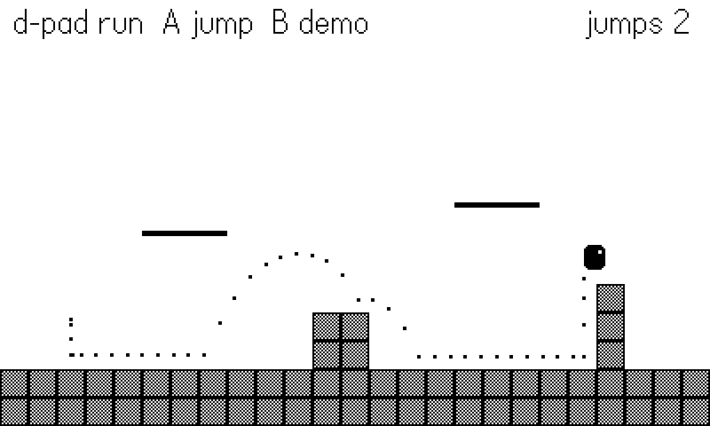
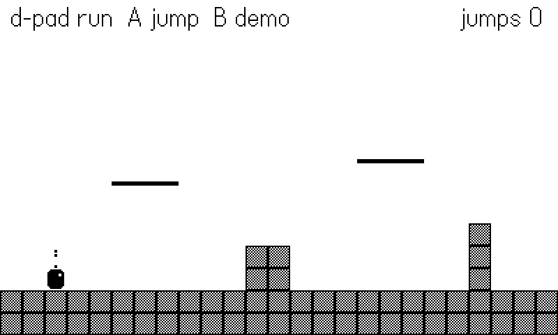

# Movement, Collision, and Physics {#sec-platformer}

Everything a game does flows through one question, asked thirty times a
second: *where is everything now?* This chapter builds the machinery
that answers it — velocity and gravity under a fixed timestep, the
axis-aligned bounding box, and movement against a tile grid that cannot
tunnel through walls no matter how fast an object goes. The example is
a compact tile platformer: a course of solid blocks and one-way
platforms, a player with run/jump physics tuned constant by constant,
and a built-in demonstration screen where a fast bullet flies straight
through a wall so you can watch the bug this chapter exists to prevent.

The techniques here were battle-tested across the tile-engine games
(`blast`, `spirit`, `relic`, `burrow`) and every platformer-shaped
project since. None of them uses the SDK sprite system's
`moveWithCollisions`; they move plain Lua tables against a grid with
about sixty lines of physics. Those sixty lines are the heart of this
chapter, and by the end you will know why each one is there.

The player in this chapter's example also draws its own motion: every
frame appends the player's position to a trail, and the trail renders
as a dotted arc behind it. That arc is not a debugging afterthought —
it is the fastest way to *see* jump feel, and it produces this
chapter's figures.

## Velocity under a fixed timestep

Chapter 3 fixed our timestep at `DT = 1/30`. The payoff arrives now:
all movement constants can be written in real units — pixels per
second, pixels per second squared — and applied with one multiply.
Here is the complete constant block for the example's player:



Read the units. `MAX_RUN = 130` means the player crosses the 400px
screen in about three seconds. `GRAV_DOWN = 1500` means a fall gains
50px/s of speed every frame. When a constant misbehaves, you can
reason about it in physical terms instead of mystery per-frame
increments — and because DT never changes, "per second" and "per 30
frames" are the same thing, deterministically.

Horizontal movement is three cases: accelerate left, accelerate
right, or (when grounded with no input) apply friction toward rest:



Two details are load-bearing. First, acceleration is clamped *inside*
the `math.max`/`math.min` call, so holding a direction can never push
past `MAX_RUN` — there is no separate clamp step to forget. Second,
friction is applied only when grounded: in the air, releasing the
d-pad keeps your horizontal speed, which is what six decades of
platformers have trained hands to expect. Air control comes from the
accelerate cases still running mid-air; only the friction case checks
`p.grounded`.

## The AABB: one comparison per edge

The axis-aligned bounding box is the workhorse of 2D collision: a
rectangle that never rotates, so overlap is four comparisons. The
cleanest statement of it in the shipped games is the fighting game's
hitbox test, which resolves every strike, hurtbox, and throw in
*Fightin' Chitin*:

```lua
-- chitin/source/fight.lua:18
local function rectsOverlap(ax, ay, aw, ah, bx, by, bw, bh)
    return ax < bx + bw and bx < ax + aw
       and ay < by + bh and by < ay + ah
end
```

The logic reads as a double negative: two boxes overlap unless one is
entirely to the left of the other or entirely above it. Each `<` pair
rules out one separation axis. Note the strict inequalities — two
boxes that exactly touch edges do *not* overlap, which means an actor
resting flush against a wall is not "colliding" with it. That
convention matters more than it looks: it lets an actor park at the
last free pixel beside a wall and test cleanly next frame.

The example stores actors as center-plus-half-extents (`{x, y}`
center, `hw`/`hh` half width and height) rather than corner-plus-size.
Centers make flipping, drawing, and distance checks simpler; convert
to corners only at the moment you test or draw.

`rectsOverlap` is the right tool for *entity versus entity* — player
against coin, hitbox against hurtbox. For entity versus *world*, when
the world is hundreds of tiles, testing every tile as a box would be
absurd. The grid itself gives us something better.

## Moving against a tile grid

A tile map is a collision structure disguised as scenery. Because
tiles sit on a regular grid, "which tiles does this box touch?" is
integer division, not search:





Treating out-of-bounds as solid is a small trick with outsized value:
the map edge becomes an invisible wall and no actor ever needs a
"did I leave the world?" check.

Now the key query: is a box, placed at a *candidate* position,
overlapping any solid tile? Convert the box's corners to tile
coordinates and scan the (tiny) rectangle of tiles between them:



The `- 0.01` on the far corner deserves a pause. A 12px-wide box
centered at `x = 8` spans pixels 2 through 13.99…, all inside tile 1.
Without the epsilon, a box whose right edge lands exactly on a tile
boundary would report itself inside the next tile — one it touches
but does not occupy — and actors would snag on walls they are merely
flush against. For a 12×14 player the double loop tests at most four
tiles. That is the whole cost of world collision.

::: {.callout-note}
## Case study: pluggable solidity in the tiles engine

The tile engine that shipped four games keeps `blocked` almost
identical to the version above, with one addition — the definition of
"solid" is a parameter:

```lua
-- tiles/core/tphys.lua:16
function Phys.blocked(x, y, hw, hh, isSolid)
    isSolid = isSolid or defaultSolid
    local tx0, ty0 = Map.tileAt(x - hw, y - hh)
    local tx1, ty1 = Map.tileAt(x + hw - 0.01, y + hh - 0.01)
    for ty = ty0, ty1 do
        for tx = tx0, tx1 do
            if isSolid(tx, ty) then return true end
        end
    end
    return false
end
```

`blast` (a Bomberman) passes an `isSolid` that also counts bombs —
except the bomb the player is currently standing on, so you can walk
off what you just dropped. `burrow` (a Boulder Dash) passes one that
counts settled boulders. The physics never changed; the *question*
did. When your game grows entities that sometimes block movement,
resist the urge to fork the physics — parameterize the solidity test.
:::

## Why fast objects skip walls — and the 1px substep

Here is the bug every collision system must answer. Movement is
discrete: an actor is at `x` this frame and `x + vx*DT` the next, and
it *occupies no position in between*. If `vx*DT` is larger than a
wall is thick, the two positions can straddle the wall — the actor
never occupies an overlapping position, every overlap test honestly
reports "no collision," and the actor sails through solid rock. This
is called **tunneling**, and it is not a rare edge case: a bullet at
720px/s moves 24px per frame, wider than a 16px tile.

Worse, tunneling is *intermittent* — the nastiest kind of bug.
Whether the two positions straddle the wall depends on where the
frame's fractional travel happens to land, so the same bullet fired
from a slightly different x passes through or collides, apparently
at random. A collision system that fails one time in five will pass
a casual playtest and then eat a player's best run. The demo screen
is rigged accordingly: the naive bullet starts at x=28 so its
positions land on 196 and then 220, bracketing the wall at 200–215
perfectly, every time. Change its starting x by a few pixels in
`demo.lua` and it will sometimes *hit* — which is the point;
"sometimes" is not a collision system.

The example ships a demonstration you can watch (@fig-tunneling).
Press B and two identical bullets fly at a one-tile-thin wall. The
top bullet integrates naively; the bottom one uses substeps:



{#fig-tunneling}

The fix the shipped games settled on is the crudest one that is also
completely reliable: **never move more than one pixel per collision
test**. Split the frame's displacement into 1px substeps, test before
each, and stop at the first blocked step:



Why does this kill tunneling stone dead? Because a wall is at least
one pixel thick, and the actor now tests every pixel of its path.
There is no gap between consecutive tested positions for a wall to
hide in. The actor also stops *flush* against the wall — at the last
free pixel — rather than embedded in it or a full frame's travel
short of it, which is exactly the resting contact the
strict-inequality AABB convention wants.

Notice the movement is **axis-separated**: all of `dx` resolves, then
all of `dy`. Diagonal movement into a corner becomes "slide along the
wall" for free, because the blocked axis stops while the open axis
keeps going. Every tile game in the catalog moves this way; sweeping
along the true velocity vector buys almost nothing on a grid and
costs you that free wall-slide.

Two quieter details of the loop reward attention. First, the final
substep is *fractional*: `math.min(1, rem)` lets a frame's leftover
0.33px of travel apply, so positions are floats and slow actors
(anything under 30px/s) still creep rather than sticking. Never
round positions in the physics — round (implicitly, by drawing) at
render time only, or sub-pixel velocities vanish. Second, the loop
is why `MAX_FALL` exists in the constants block: terminal velocity
is usually sold as realism, but its practical job is bounding the
substep count and keeping a long fall readable. An uncapped fall
after a three-second drop would move 4,500px/s — 150 substeps and
an unfollowable blur. The cap says: past this speed, extra velocity
adds cost and subtracts legibility.

::: {.callout-note}
## Case study: the corner nudge

The tiles engine adds one refinement on top of `Phys.move` worth
knowing about: `Phys.moveAssist` (`tiles/core/tphys.lua:60`), the
classic Game Boy Zelda / Bomberman corner assist. When an actor is
blocked on its movement axis but its center is within half a tile of
an open corridor, `moveAssist` nudges it perpendicular — capped at
the actor's own speed — so it slides around the corner instead of
grinding against it. Top-down games with tile-sized doorways feel
*broken* without it (players clip corners constantly and read every
snag as bad controls); a gravity platformer like this chapter's
example doesn't need it, because jumping is the corner assist. If
you build top-down, steal it.
:::

::: {.callout-note}
## What does it cost?

The loop looks expensive and is not. A player at top speed moves 4–5
px per frame — five substeps, each testing at most four tiles: at
worst forty table lookups. Even the demo's 24px/frame bullet is 24
cheap tests. The per-second constants and fixed DT bound your maximum
displacement, so the substep count is bounded too. If you ever need
projectiles at hundreds of pixels per frame, switch those (and only
those) to a raycast; for everything that has a body, 1px substeps are
the answer that shipped sixty games.
:::

## One-way platforms

Platforms you can jump up through and stand on are a solidity rule,
not a new physics system: a one-way tile is solid only when the
actor's *feet cross its top edge moving downward*. From below or from
the side it is air. Substeps make the crossing test almost trivial —
each step moves at most 1px, so "did my feet enter a new tile row
this step?" is a two-`floor` comparison:



The vertical half of `Phys.move` calls this only when moving down
(`sy > 0`) and only when not deliberately dropping. Dropping through
is the standard down-plus-jump chord; the player sets an 8-frame
`drop` window during which the platform check is skipped, long enough
for its feet to clear the tile before the platform turns solid again.

::: {.callout-warning}
## Do not test one-way tiles in `blocked`

The tempting shortcut — making `Map.solid` return `true` for one-way
tiles when the actor is above them — poisons every other query.
`blocked` is used for horizontal movement, for spawn checks, for
standing probes; a one-way tile must answer differently depending on
*direction of travel*, which only the vertical move loop knows. Keep
the crossing test where the crossing happens.
:::

## Jump feel: gravity is a design constant

A jump is one line — `p.vy = JUMP_VEL` — and then feel is everything
that happens on the way down. Real projectiles trace symmetric
parabolas; games that feel good do not. The example uses three
gravities:



`GRAV_UP = 780` on the way up and `GRAV_DOWN = 1500` on the way down
makes the descent almost twice as urgent as the rise — floaty going
up, snappy coming down, and the player spends less time in the
helpless falling state. The third gravity, `APEX_GRAV`, kicks in when
vertical speed is nearly zero: the top of the jump *hangs* for a few
extra frames, which is where players steer, aim, and feel clever.
None of this is physically honest and all of it is standard practice;
the constant block at the top of the chapter is a feel-tuning panel,
not a physics textbook.

Don't tune those constants by feel alone — derive them from the two
numbers you actually care about, jump *height* and *time to apex*.
For a rise of `h` pixels reaching its peak in `t` seconds:

    GRAV_UP  = 2 * h / t^2
    JUMP_VEL = -2 * h / t

The example's `-310` and `780` come from wanting roughly 60px of
rise (comfortably over the course's three-tile pillar, with margin)
in about 0.4 seconds. Design in tiles-cleared and seconds, then
compute; when a level later needs a four-tile jump, you change `h`
and re-derive instead of nudging magic numbers until Tuesday.

You can read the result directly off the player's trail
(@fig-jump-arc): dots cluster at the apex (slow means close
together), spread going down (fast means far apart), and the descent
is visibly steeper than the rise.

{#fig-jump-arc}

After moving, the player converts collision results back into state:



A downward hit lands (grounded, `vy = 0`); an upward hit bonks a
ceiling (`vy = 0`, keep falling next frame). Standing still is the
subtle case: gravity accelerates the player into the floor every
frame, the 1px substep is immediately blocked, and `hitY` re-confirms
`grounded` — so "am I on the ground?" never needs a separate probe.

The trail itself is four lines and worth stealing for any movement
work:



## Coyote time and jump buffering

Two forgiveness windows separate a jump that *works* from one that
feels fair. **Coyote time**: for a few frames after walking off a
ledge, a jump still fires — players press jump at the edge pixel and,
thanks to reaction time, are usually one frame late. **Jump
buffering**: a jump pressed a few frames before landing is remembered
and fires on touchdown — players time the *landing*, not the frame
after it. Both are counters, refreshed on one side and spent on the
other:



The jump condition is then simply `buffer > 0 and coyote > 0` — "a
recent press" meets "recent ground." Both constants are 4 frames
(133ms). Push them past 6–7 and players start noticing jumps from
thin air; @sec-input covered the same buffering idea at the input
layer, and here you see where it cashes out.

## The course, the seam, and the bot

The example's course is built in code — two ground rows, a step, two
one-way platforms, a pillar — and pre-rendered once into a 400×240
image. The map never changes, so repainting 375 tiles a frame is
pure waste:



{#fig-course}

Input flows through the single-seam pattern from @sec-input — the
harness bot is consulted first, and a human's buttons fill in
otherwise:



The figure script runs right and presses jump on three scheduled
frames. Nothing about the course requires precision: there are no
pits, and every obstacle can be cleared from a standstill, so a
mistimed scripted jump degrades the figure, never the run. Building
bot-forgiving levels for your test scripts is cheaper than building
frame-perfect bots — the autopilot discussion in @sec-maze and the
harness chapter (Chapter 18) return to this.

## What you know now

- Movement constants live in per-second units and get one `* DT` on
  the way in; the fixed timestep makes them deterministic.
- AABB overlap is four strict comparisons (`chitin`'s
  `rectsOverlap`); use it entity-vs-entity, and use the grid itself
  for entity-vs-world.
- `Phys.blocked` turns box-vs-world into at most four tile lookups —
  mind the `- 0.01` edge epsilon, and parameterize solidity when
  entities start blocking movement.
- Tunneling happens because discrete movement occupies no positions
  between frames; 1px substeps test every pixel of travel, stop
  actors flush against walls, and cost almost nothing at gameplay
  speeds.
- Axis-separated movement gives wall-sliding for free.
- One-way platforms are a directional solidity rule in the vertical
  move loop, not a map property.
- Jump feel is asymmetric gravity (light up, heavy down, lighter
  still at the apex) plus two 4-frame forgiveness counters: coyote
  time and jump buffering.

The player now moves beautifully — and silently, in a world with no
consequences. @sec-juice adds the thump: timers, animators, screen
shake, and the rest of game feel.
