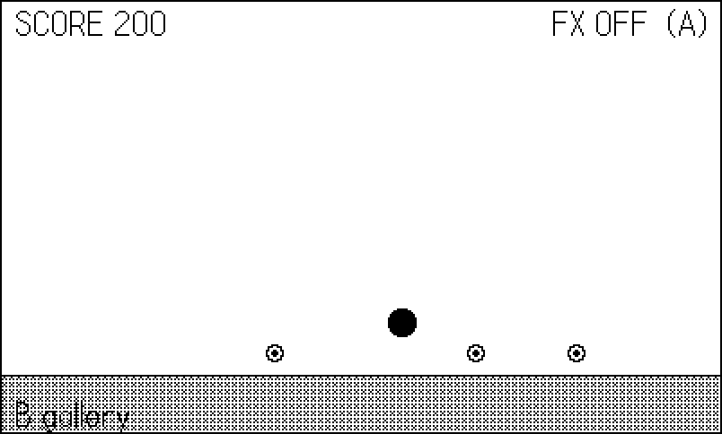

# Game Feel: Timers, Animators, and Effects {#sec-juice}

Take a ball, make it bounce, and give it coins to collect. Correct,
complete — and dead. Now make the screen jolt when it lands, freeze
time for three frames on a pickup, invert the display for two, throw
a fistful of particles, squash the ball flat on impact, and float an
eased `+100` up from the coin. Same game. It feels *alive*. That gap
— between correct and alive — is what this chapter is about, and the
industry's name for closing it is **juice**.

The example is exactly that scene, with every effect behind one
switch. Press A and the whole apparatus turns on or off, so you can
A/B the difference in a single session (@fig-scene-plain and
@fig-scene-juiced are the same scene, twelve frames of game time
apart). Along the way we cover the SDK's three timing tools —
`playdate.timer`, `playdate.graphics.animator`, and the easing
function catalog they share — and, honestly, why the sixty shipped
games mostly rolled their own instead. Both answers belong in your
toolbox; this chapter is where you learn which to reach for.

## `playdate.timer`: the SDK's clock

`playdate.timer` (import `CoreLibs/timer`) is the SDK's
general-purpose delayed-and-animated-value machine. It comes in three
shapes.

**Callback timers** run a function after a duration:
`playdate.timer.new(2000, fn)` calls `fn` after two seconds. Extra
arguments are passed through to the callback. Set `repeats = true` on
the returned timer and it fires every two seconds until you
`:remove()` it.

**`performAfterDelay`** is the one-shot convenience:
`playdate.timer.performAfterDelay(delay, fn, ...)` — fire and
forget. (A cousin, `playdate.timer.keyRepeatTimer(callback)`, fires
immediately, again after 300ms, then every 100ms — the standard
key-repeat cadence for scrolling menus; @sec-tilt's gridview uses
the same rhythm.)

**Value timers** animate a number instead of firing a callback:
`playdate.timer.new(duration, startValue, endValue, [easing])`
gives you a timer whose `.value` property glides between the
endpoints, optionally shaped by an easing function. The example uses
one for its collect rings:



Timers also expose `paused`, `:pause()`/`:start()`, `:reset()`,
`timeLeft`, `repeats`, `reverses`, and `discardOnCompletion` (default
`true`, which is why finished timers vanish without cleanup). It is a
complete little system — with one absolute requirement.

::: {.callout-warning}
## No `updateTimers()`, no timers

Timers do nothing unless `playdate.timer.updateTimers()` runs in
your `playdate.update()` every frame. Not "run slowly" — nothing.
The callback never fires, `.value` never moves, and no error is
raised anywhere. The SDK documentation marks this *Important* and
repeats it as a *Caution* on every API that uses timers internally
(`playdate.ui.gridview` among them, from @sec-tilt). If a timer
"mysteriously" does nothing, this is the cause, every time. The
example's update loop opens with it:


:::

### An honest sidebar: one game in sixty

Across the shipped catalog, exactly one game uses `playdate.timer`:
*Archer's Zoomie Circuit*, which reached for `performAfterDelay` to
build two-note SFX jingles:

```lua
-- archer/source/sfx.lua:94
function Sfx.star()
    play("pop", 1320, 0.4, 0.10)
    playdate.timer.performAfterDelay(70, function()
        play("jingle", 1760, 0.35, 0.12)
    end)
end
```

That is a perfect use: a fire-and-forget delay where nothing depends
on *which frame* the second note lands. Everything else in sixty
games used a different tool, for one reason: **timers run on wall
time, and the games run on frames.** A frame-indexed game with a
fixed DT (@sec-modes) wants "in 45 frames," not "in 1500ms" — the
two agree at a smooth 30fps and drift apart the moment a frame
hiccups or the harness runs unthrottled at `setRefreshRate(0)`,
where a 600ms timer suddenly spans hundreds of simulated frames.
Wall-clock effects also cannot be reproduced by a deterministic
figure script. The house alternative is a dozen lines:



`Util.tick()` runs first thing in the update loop, so deferred calls
land on an exact, reproducible frame. The example uses it to respawn
collected coins 45 frames later. Use `playdate.timer` for UI and
wall-clock conveniences; use a deferred-call queue for anything the
game logic depends on.

The SDK itself half-agrees with this critique: it ships
`playdate.frameTimer` (import `CoreLibs/frameTimer`), a complete
mirror of the timer API measured in frames instead of milliseconds —
same constructors, same value-timer form, and its own required
`playdate.frameTimer.updateTimers()` call each frame. If you want
frame-exact timing *with* the SDK's pause/repeat/easing machinery,
it is the right tool. The house code still prefers the bare queue
for a blunt reason: a deferred call is one integer and one function,
easy to reason about, easy to count in a heartbeat, and impossible
to forget to update — the game loop *is* its update.

Two lifecycle notes that bite people. A finished one-shot timer
removes itself, but only *at the next* `updateTimers()` call — if
you inspect `playdate.timer.allTimers()` immediately after a
callback fires, the corpse is still there. And `:remove()` on a
repeating timer is the only way it ever stops; a `repeats = true`
timer created in a scene you later tear down keeps firing into the
void unless the teardown removes it. Timers are global; your scenes
are not.

## `playdate.graphics.animator`: values with a shape

Where a timer *can* animate a value, an animator (import
`CoreLibs/animator`) exists only for that. `gfx.animator.new(duration,
startValue, endValue, [easing, [startTimeOffset]])` returns an object
whose `:currentValue()` you read each frame, plus `:ended()`,
`:progress()`, and `:reset()`. Animators can also traverse geometry —
pass a `playdate.geometry` lineSegment, arc, or polygon and
`:currentValue()` returns *points* along it, which turns "swoop this
menu card in along a curve" from trigonometry into a constructor
call — and chain multi-part moves via parallel arrays of durations
and parts. The `startTimeOffset` argument delays the start, so a
hand of five cards dealt with offsets 0, 80, 160… cascades from one
line of setup. A sprite can even ride one via `setAnimator`
(@sec-sprites).

The example's score popups are the canonical small use:



Each popup owns an animator running 0 to −34 over 600ms with
`outCubic` easing: it leaps up fast and settles gently, which reads
as *pop* rather than *drift*. The draw pass just adds
`anim:currentValue()` to the y position and drops the popup once
`anim:ended()` reports true.

Animators share the timer's wall-clock caveat (the SDK docs caution
that animators do not even pause during `playdate.wait()`), but for
decorative motion that is usually fine — if a popup rises a shade
faster on a slow frame, nobody's save file cares.

## The easing catalog

Both timers and animators accept an easing function, and the SDK
ships the full Robert Penner set in `playdate.easingFunctions`
(import `CoreLibs/easing`): `linear`, then `in`/`out`/`inOut`/`outIn`
variants of `Quad`, `Cubic`, `Quart`, `Quint`, `Sine`, `Expo`,
`Circ`, plus the character pieces — `Back` (overshoots and returns),
`Elastic` (springs), `Bounce` (bounces). Every one takes the same
four arguments `(t, b, c, d)` — elapsed time, beginning value, total
change, duration — and returns the current value, which means you can
also call them directly, no timer required, whenever you have your
own 0-to-1 progress.

Names beat formulas here, and a picture beats both. The example's
second screen plots twelve of them (@fig-easing-gallery):



{#fig-easing-gallery}

A working shorthand for choosing: **`out*` for things arriving**
(menus sliding in, popups appearing — fast start, gentle landing),
**`in*` for things leaving** (gentle start, accelerating exit),
**`inOut*` for things traveling** between two resting states.
`outBack` makes UI feel enthusiastic; `outElastic` makes it feel
springy; `outBounce` is almost always a joke, and occasionally the
right one. `linear` is for progress bars and little else — motion
with constant velocity reads as mechanical.

## `blinker`: the last SDK piece

`playdate.graphics.animation.blinker` (import `CoreLibs/animation`)
is a boolean metronome: `blinker.new([onDuration, offDuration, loop,
cycles, default])`, then read its `.on` property to decide whether to
draw a thing. The example uses one for its `FX ON` label:



Like timers, blinkers have an update requirement —
`gfx.animation.blinker.updateAll()` every frame — and the same
silent-nothing failure mode when you forget. For flashing `PRESS A`
prompts it beats a hand-rolled `frame % 20 < 10` mainly when the on
and off durations differ; below that threshold, the modulo is
honestly fine.

## Hand-rolled effects: the juice itself

Now the effects the SDK does not provide — the ones that carry the
feel. All four follow one design rule from the shipped games: **every
effect is a function call at the moment of impact**, and the caller
neither knows nor cares how it renders. `Fx.shake(6, 3)` at the
bounce; done. And every one of them checks a master switch, which is
what makes the A/B demo — and per-effect accessibility settings —
possible. (The system exposes one such setting itself:
`playdate.getReduceFlashing()` reads the player's system-level
"reduce flashing" preference, and your flash and shake effects
should respect it.)

**Screen shake** is offset jitter. While the shake counter runs, the
whole scene draws at a small random offset via `gfx.setDrawOffset`;
the offset is re-rolled every frame, and reset to zero after drawing:



Magnitude 2–3 for hits, 5+ for explosions, and always brief — 6
frames is a fifth of a second. A shake that lingers reads as broken,
not powerful.

**Hit-flash** inverts the whole screen for a frame or two. On a 1-bit
display this is the single highest-contrast event available — the
entire panel slams — and the XOR fill makes it a two-liner over the
finished scene:



**Freeze frames** (hitstop) are the boldest trick: on impact, the
world simply does not update for 2–4 frames. The scene still draws —
nothing flickers — but time itself hiccups, and the impact gains
weight out of all proportion to the cost:



The wiring in the update loop is one guard: `if not Fx.frozen() then
Scene.update() end` — sim skipped, draw untouched. Anything that
*must* keep moving during hitstop (a pause menu, say) belongs outside
that guard. The fighting game *Fightin' Chitin* leans on the same
idea at larger scale, freezing the whole sim between rounds
(`chitin/source/main.lua:420`) so KO'd bodies hang a beat before the
verdict.

**Particles** are a shared pool of short-lived dots with velocity and
gravity — the same architecture every phosphor vector game ships:

```lua
-- phosphor/vec/fx.lua:20
function Fx.burst(x, y, n, speed)
    speed = speed or 70
    for _ = 1, n do
        if #particles >= MAX_POOL then return end
        local a = math.random() * math.pi * 2
        local s = speed * (0.4 + math.random() * 1.0)
        particles[#particles + 1] = {
            x = x, y = y,
            vx = math.cos(a) * s, vy = math.sin(a) * s,
            life = 0.25 + math.random() * 0.4,
        }
    end
end
```

One pool per game, `burst` to fill it, one update pass integrating
positions and expiring lives, one draw pass of pixels. The key word
is *shared*: nothing owns its particles, so a burst can outlive the
coin (or enemy, or asteroid) that spawned it, and there is exactly
one place to cap the count — which phosphor does, with the soft cap
`MAX_POOL` (400) guarding the insert. A pathological cascade of
bursts then degrades to "fewer sparks" instead of an unbounded frame
cost (@sec-phosphor). The example's version adds gravity and an
upward bias so bursts fountain:



**Squash and stretch** is animation's oldest principle applied at
runtime: scale the ball wide-and-flat for a few frames on landing,
narrow-and-tall while moving fast, and its constant area starts to
imply weight and springiness:



## The scene: wiring impact to effects

Here is the whole collision-to-juice pipeline in one place — the
bounce handler calls the effects and the coin respawn, each one a
single line:



{#fig-scene-plain}

{#fig-scene-juiced}

Compare @fig-scene-plain and @fig-scene-juiced: identical simulation,
identical rules, and the juiced frame is unmistakably a *game*. The
figure script flips the master switch on frame 140, between two
bounces, precisely so these two shots bracket the change.

Order matters when effects stack, and the example's frame is a
worked answer. *Update side*: the freeze check runs first (frozen
means nothing else simulates), then the sim, then `Fx.update`.
*Draw side*: the shake offset is applied before anything draws (the
whole world jolts together), particles and popups draw over the
scene but under the HUD, and the XOR flash goes down absolutely
last so it inverts the finished frame, HUD included. Get the flash
and the offset in the wrong order and you invert a half-drawn frame
or shake only half the world — both instantly visible, neither ever
reported by an error.

Durations are the other half of stacking. The example's collect
fires a 3-frame freeze, a 2-frame flash, a 6-frame shake, ~12-frame
particles, and a 600ms popup — impact, punctuation, tremor,
debris, information, each on its own clock, ordered from shortest
to longest. That cascade shape (the sharpest effects are the
briefest) is a reliable default for any impact you design.

### Feel on one bit

Two of this kit's members are stronger on the Playdate than anywhere
else, and one is weaker. Stronger: the hit-flash, because inverting
a 1-bit screen is a *total* event — there is no muted, tasteful
version, and the panel's whole character reverses for a frame.
Stronger too is hitstop, because with no color and no motion blur,
the Playdate reads stillness beautifully. Weaker: subtle alpha-style
effects — a soft white glow or a translucent shockwave needs dither
(@sec-dither), and fine dither at 30fps can shimmer. The idiomatic
substitutes are structural: swap a sprite's fill from dithered gray
to solid black for a "charged" state, pulse an outline's thickness,
or draw a one-frame expanding ring like the example's collect. And
remember the other half of feel is audible — the thump this chapter
builds visually is completed by the SFX patterns of @sec-sfx; the
shipped games trigger sound and screen effects from the same
`Fx.*`-style call so the two can never drift apart.

::: {.callout-note}
## Juice is a budget, not a checklist

Every effect here earns its place by marking a *player-meaningful
event*. The failure mode is spraying all of them at everything —
constant shake, perpetual particles — after which nothing reads as
important because everything shouts. A useful discipline from the
shipped games: rank your events (coin, then combo, then death), and
spend the big effects (freeze, flash) only on the top tier. If the
screen is never still, juice has become noise.
:::

## What you know now

- `playdate.timer` covers delayed callbacks (`performAfterDelay`),
  repeating timers, and eased value timers — and every one of them
  is inert unless `playdate.timer.updateTimers()` runs each frame.
- Timers and animators run on wall time; frame-indexed games mostly
  want a deferred-call queue (`Util.after`) so effects land on
  deterministic frames. One shipped game in sixty needed the SDK
  timer, and only for SFX jingles.
- `gfx.animator` animates values (and geometry paths) with easing;
  read `:currentValue()`, retire on `:ended()`.
- `playdate.easingFunctions` is the full Penner set with signature
  `(t, b, c, d)`, callable directly; out-eases arrive, in-eases
  leave, `Back`/`Elastic`/`Bounce` add character.
- The hand-rolled four: shake is draw-offset jitter, hit-flash is an
  XOR fill, freeze frames skip the sim but not the draw, and
  particles live in one shared pool (`vec/fx.lua`).
- Route every effect through a switchable Fx module — for A/B
  tuning, for accessibility, and for figures.

The ball now lands with a thump. @sec-maze gives your games someone
to outwit: enemies that find their way through a maze, and the bots
that play against them.
