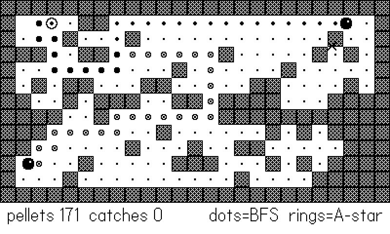
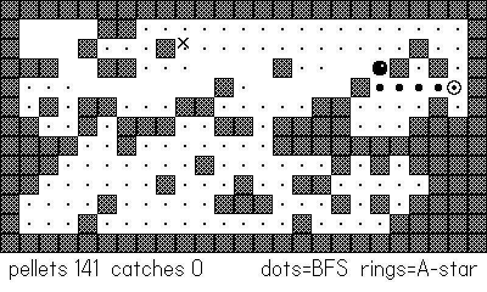

# Enemies, Pathfinding, and Bots {#sec-maze}

An enemy that walks into walls is scenery. An enemy that corners you
in a dead end you chose badly is a *game*. The distance between the
two is pathfinding, and this chapter covers both ways to get it on a
Playdate: a hand-rolled breadth-first search you will understand down
to the last table index, and the SDK's built-in A* in
`playdate.pathfinder`. Then it turns the same machinery around and
points it at the player's chair — because the autopilots that
smoke-test every game in this book (and captured every figure in it)
are enemies AI with the controller in their hands, and they fail in
instructive ways that sixty shipped games have already paid for.

The example is a maze chase. A random-but-connected maze fills the
screen; a player bot vacuums pellets, plotting its route with BFS; two
ghosts hunt it — one on hand-rolled BFS, one on
`playdate.pathfinder`'s A* — and a moth glides *over* the walls on
steering behaviors, for the enemies that don't live on a grid. The
critical feature: both ghosts **draw their current plan on the maze**,
dots for BFS and rings for A* (@fig-maze-paths). Watching two
pathfinders think in public teaches more than any diagram of one.

## Grid BFS from first principles

Breadth-first search answers "what is the shortest route from here to
there?" on any grid where steps cost the same. It explores outward
from the start in rings — all cells one step away, then two, then
three — so the first time it touches the goal, it got there by a
shortest path. Three ingredients:

- a **queue** of cells to visit, oldest first;
- a **parent map** recording, for each visited cell, which cell first
  reached it (this doubles as the visited set);
- a **walk-back**: once the goal is found, follow parents from goal
  back to start, and you have the path in reverse.

Here is the example's implementation, complete:



Details that matter, in order of how often their absence has caused
bugs. The queue uses a **head index** instead of
`table.remove(q, 1)` — removing from the front of a Lua array shifts
every element, turning a linear search quadratic; bumping `head` is
free, and the "dead" front entries are garbage-collected with the
queue. Cells are marked in `parent` **when enqueued**, not when
visited, or the same cell enters the queue from every neighbor.
And the goal test takes a *function*, so the same BFS serves "reach
the player," "reach any pellet," or "reach any cell where X" without
modification — the same pluggable-predicate move as `isSolid` in
@sec-platformer.

The key encoding trick is one integer per cell: `r * 100 + c` packs
both coordinates into a table key that is cheap to hash and trivial
to unpack (`% 100` and `// 100`). The rival AI and the smoke
autopilot in *Clam Jumper* share exactly this BFS; its version
returns the first step directly, unpacking as it walks back:

```lua
-- clamjumper/source/util.lua:32 (Util.pathNext, abridged)
if not goal then return nil end
-- walk parents back until the step off the start tile
local cc, cr = goal[1], goal[2]
while true do
    local p = parent[key(cc, cr)]
    if p == key(sc, sr) or p == -1 then
        return cc - sc, cr - sr, goal[1], goal[2]
    end
    cc, cr = p % COLS, p // COLS
end
```

That is the **first-step extraction**: an actor re-plans every time it
reaches a cell, so it only ever needs step one of the plan. Returning
the whole path (as the example does) costs a little more and buys the
overlay figures; in a game, return whichever your consumers need.

### One field, many queries

There is a third shape of BFS worth knowing: run it from a source
with *no goal at all* and keep the whole distance table. The tiles
engine does exactly this — `Phys.bfs` (`tiles/core/tphys.lua:104`)
returns `dist[ty][tx]` for every reachable cell, and its header
comment tells you why: "Shared by enemy chase AI and every
autopilot." Root the field at the *player* once per frame, and then
any number of enemies answer their movement question with four table
lookups each:

```lua
-- tiles/core/tphys.lua:148
-- first step from (sx,sy) toward smaller values in a BFS
-- field rooted at the target
function Phys.descend(dist, sx, sy)
    local best = dist[sy] and dist[sy][sx]
    if not best then return nil end
    local bx, by
    local dirs = { { 1, 0 }, { -1, 0 }, { 0, 1 }, { 0, -1 } }
    for i = 1, 4 do
        local nx, ny = sx + dirs[i][1], sy + dirs[i][2]
        local d = dist[ny] and dist[ny][nx]
        if d and d < best then
            best, bx, by = d, dirs[i][1], dirs[i][2]
        end
    end
    return bx, by
end
```

Chasing is "step to a neighbor with a smaller distance." Fleeing is
the same function with the comparison flipped — step to a *larger*
distance and you get credible Pac-Man scatter behavior for free.
One search, rooted at the target, serves ten enemies for the price
of one; ten searches rooted at ten enemies is how grid AI gets
expensive. When your enemy count grows past two or three, flip the
search around.

::: {.callout-note}
## BFS is cheap enough to spam

This maze is 25×13 = 325 cells. A full BFS touches each open cell
once — a few hundred table operations, tens of microseconds on the
device. The example re-plans *three* searches per cell-arrival
(player and both ghosts... one of them via the C-side pathfinder) and
does not register on the frame budget. Grid pathfinding earns its
reputation for cost at thousands of cells with dozens of agents;
at Playdate scales, re-plan freely and keep the code simple.
:::

## Flood fill: connectivity as a guarantee

Run BFS with no goal until the queue empties and you get a **flood
fill**: the set of every cell reachable from the start. That turns
"is this maze solvable?" from a prayer into a post-processing step —
generate walls randomly, flood from the player's corner, and *seal
anything the flood never reached*:





After sealing, the open set is one connected region *by
construction*: every pellet is reachable, every ghost can reach the
player, and no actor can be born walled-in. *Clam Jumper* introduced
this pattern (`clamjumper/source/maze.lua:21`, `floodFrom`) after its
coral reefs kept generating pockets that trapped clams the player
could never collect — the autopilot found the flaw, and the flood
fill fixed the generator rather than patching the symptom.

## The SDK's pathfinder: A* for free

`playdate.pathfinder` is the SDK's graph-search module — A* running
in C, which finds the same shortest paths as BFS but explores far
fewer cells by using a heuristic (default: manhattan distance) to
push toward the goal first. The convenience constructor maps
perfectly onto tile games:



`new2DGrid(width, height, allowDiagonals, includedNodes)` builds one
node per cell, numbered 1 to `width*height` in row-major order, with
x, y set to the grid position. `includedNodes` is a flat array of 1s
and 0s — walls get 0 and receive no connections, though the node
still exists, which makes later edits easy. Two costs to know about:
connection weights default to 10 for orthogonal moves and 14 for
diagonal (≈ 10√2, so diagonals price honestly), and the graph is
built once per maze, *not* per query.

Querying it:



`findPath` returns an array of `pathfinder.node` objects — read
`.x`/`.y` straight off them — or `nil` when no path exists, and the
example converts immediately back into its own `{c, r}` form so the
rest of the game has exactly one path representation. The optional
extras: a custom heuristic function `(startNode, goalNode) ->
estimate` (the default manhattan estimate needs the nodes' x, y
set, which `new2DGrid` does for you), `findPathToGoalAdjacentNodes`
(stop *next to* the goal — right for melee chasers, and the only
way to path to a target standing on an excluded node), an
ID-flavored twin `findPathWithIDs` if you'd rather track integers
than node objects, and a whole mutation API (`addConnections`,
`removeNodeWithXY`, `node:addConnection` with per-edge weights) for
doors that open and bridges that collapse. Weights are worth a
second look even on a static map: A* prefers a longer path of
lighter edges, so pricing the edges *into* a hazard tile at 30
instead of 10 gives you enemies that walk around fire — and through
it when there's no other way — without a line of new logic.

::: {.callout-warning}
## Graphs go stale

The pathfinder graph is a *copy* of your map, and nothing keeps them
in sync. Open a gate in your tile grid and the A* ghost still walks
around it — or worse, a wall you added is still walkable — with no
error anywhere. Rebuild the graph (or edit the affected node's
connections) in the same function that mutates the map, exactly as
the example's `rebuild()` regenerates both together. If your ghosts
ignore new walls, this is why.
:::

So which one? **BFS** when you want zero dependencies, a
goal-predicate ("nearest pellet") rather than a fixed target, or the
distance-field variants that answer many queries at once. **The SDK
pathfinder** when you want weighted edges, diagonals, big maps, or C
speed without writing C. In the example the ghosts' overlays lie on
top of each other most frames — on an unweighted grid the algorithms
agree on length and differ only in tie-breaking, which is exactly
what @fig-maze-paths shows.

{#fig-maze-paths}



The chase logic itself is symmetric — each ghost re-plans on every
cell arrival, stores its full path for drawing, and takes step two
(step one is the cell it is standing on):



## Cells for logic, pixels for eyes

One structural decision makes everything above simpler than it
looks: actors in the example live on *cells*, not pixels. An actor
is "at (c, r), heading to (nc, nr), `prog` frames into the trip";
all AI — pathfinding, pellet eating, catch detection — operates on
the integer cell coordinates, and the pixel position is derived
cosmetically by interpolating between the two cell centers at draw
time. Decisions happen only at cell arrival, which means an actor
can never be halfway into a wall, "which cell am I in?" never needs
rounding rules, and catches compare two pairs of integers. The
alternative — pixel-positioned actors constantly re-deriving their
grid cell — works, as @sec-platformer showed for physics-driven
movement, but for grid AI it reintroduces every alignment bug the
grid was supposed to prevent.

Speed then becomes *frames per cell*, and the pursuit dynamics fall
out of one ratio: the player crosses a cell in 5 frames, the ghosts
in 7. The player escapes down straightaways, the ghosts gain in
corners (re-planning is free; running is not), and a two-ghost pinch
is genuinely dangerous — all from two integers. Tune chase games
here first; a speed ratio does more than any cleverness in the
planner.

## Steering: enemies off the grid

Not everything lives on tiles. For enemies that fly, drift, or
swim, the classic **steering behaviors** produce organic motion from
three tiny rules, each computing a desired direction and turning the
actor *gradually* toward it:

- **seek**: turn toward the target;
- **flee**: seek with the vector reversed;
- **wander**: add a little random jitter to the heading.

The gradual turn — a capped radians-per-frame budget — is the entire
trick. An actor that can only bend its path sweeps into curves,
overshoots, and circles; it reads as alive because, like anything
alive, it has momentum. The example's moth seeks the player, spooks
and flees when it gets close, and wanders throughout:



The angle-wrapping loop is the classic trap: without normalizing
`want - heading` into [−π, π], an actor at heading 179° chasing a
target at −179° turns 358° the long way round. Every steering bug
you will ever write is this bug. The shipped games use steering for
their off-grid hunters — *Peckish*'s gull circles its mark before
committing to a dive, and the crabs wander the wet sand between
sprints — while grid logic drives anything that must respect walls.

## Waves and ramps

Enemy *placement over time* is a system too, though a small one. The
proven shape from the arcade-style games: spawn enemies in **waves**
— a data table per wave holding a count, a spawn interval, and a
composition (`{ crabs = 4, gulls = 1, every = 45 }` reads better
than any code that computes it) — consumed by a single spawn timer
that counts frames and pops the next entry. Keep three rules. Spawn
*off-screen or far from the player* (the flood-fill's reachable set
doubles as a legal-spawn list; filter it by distance). Announce the
wave (a one-second banner is cheap and turns raw difficulty into
drama). And ramp by deriving the numbers from a wave index — never
by mutating global state in place. *Clam Jumper*'s generator shows the pattern in
miniature: each new reef derives its wall density as
`C.CORAL_DENSITY + math.min(reef * 0.01, 0.1)` — a function of the
level number, *capped*, so the ramp has a ceiling the design was
actually tested at. Derive, cap, and keep the difficulty function in
one place; a ramp scattered across five files cannot be tuned.

## Autopilot design: the same AI, pointed at the chair

Here is this book's recurring move: the player bot in this example is
not test scaffolding bolted on afterward — it *is* an AI agent built
from the chapter's own parts (BFS to the nearest pellet), wired in
through the input seam from @sec-input. Three lessons, each learned
the hard way across the shipped catalog and recorded in the
development guide, separate autopilots that find bugs from autopilots
that *are* bugs.

**Detect stuckness by goal progress, not movement.** The obvious
stuck check — "has the bot moved lately?" — fails exactly when you
need it: a bot grinding along a wall, or orbiting an unreachable
goal, moves constantly while achieving nothing. Track the thing that
matters instead: best distance-to-goal reached, or best x attained in
a runner. The example's player does precisely this, and answers
stuckness with the third lesson:



**When boxed in, wander-burst.** A stuck bot that keeps re-running
the same deterministic logic re-makes the same decision forever. A
short burst of *random* moves — three cells here — breaks the
symmetry cheaply, after which normal planning resumes from somewhere
new. (Grinding at the wall harder is what the deterministic logic
already tried.)

**Give area weapons a stand-off distance.** Not applicable to
pellets, but paid for in blood elsewhere: an autopilot with a bomb,
a lob, or any area-of-effect tool must check for friendlies (itself
included) inside the blast radius and hold distance from its own
target, or it will clear the level by dying — a lesson the shipped
bombers and lobbers each paid for before the stand-off check became
house style.

::: {.callout-note}
## Bots find design flaws, not just crashes

The point of an autopilot is to exercise code paths, not to win. But
when a competent bot *cannot* reach the objective, ask whether a
human could: the goal-progress metric that keeps the bot honest also
measures your level design. Unreachable collectibles and
doors-without-keys in the shipped games were found exactly this way
— the bot's failure was the bug report.
:::

@fig-maze-chase shows the full system mid-game: pellets thinned out
where the player has swept, both ghost plans converging, the moth
mid-flutter, and the HUD counting catches.

{#fig-maze-chase}

## What you know now

- BFS is a head-indexed queue, a parent map keyed by packed
  coordinates, and a walk-back; mark cells when *enqueued*, and take
  a goal predicate instead of a fixed target.
- First-step extraction (`clamjumper`'s `Util.pathNext`) is all a
  re-planning actor needs; full paths are for overlays and debug
  draws.
- Flood fill turns maze generation into a guarantee: seal what the
  flood can't reach and the open set is connected by construction.
- `playdate.pathfinder.graph.new2DGrid` builds a C-speed A* grid
  (weights 10/14, `includedNodes` for walls); `findPath` returns
  nodes or `nil` — and the graph must be rebuilt when the map
  changes.
- Steering is seek/flee/wander under a capped turn rate; normalize
  your angle differences or turn the long way round.
- Autopilots are enemy AI pointed at the chair: measure goal
  progress (not movement), wander-burst when boxed in, and give
  area weapons a stand-off distance.
- Both halves scale up in Part VII: the shared BFS field — one flood
  fill that every chaser reads — in @sec-tiles, and the autopilot as a
  written *walkthrough* rather than a steering behavior in @sec-lore.

The ghosts can hunt, the bot can play all night — but the moment the
Playdate powers down, everything it earned evaporates. @sec-save
makes progress stick.
