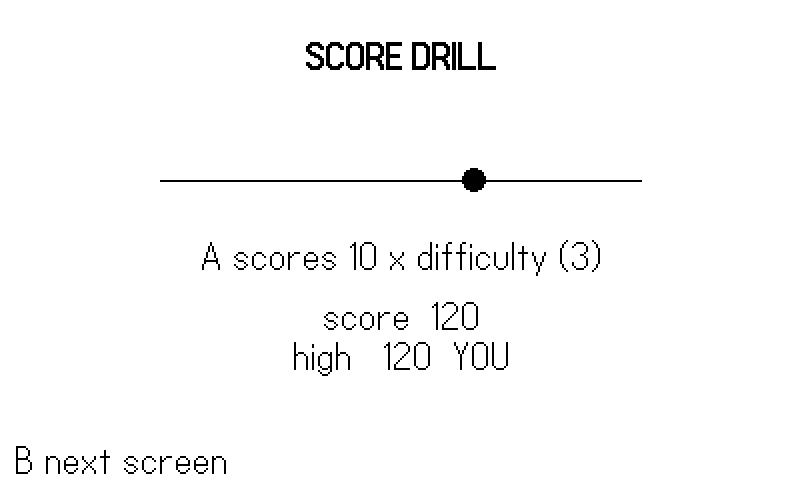

# Saving and Data {#sec-save}

A game that forgets you is a demo. The moment your game has a high
score, an options screen, or an unlocked door, it needs persistence —
and on the Playdate that means `playdate.datastore`, a
pleasantly tiny API that writes Lua tables to JSON files and reads
them back. The API is the easy part. The craft is everything around
it: loading saves that don't exist yet, loading saves written by a
version of your game you've since rewritten, and keeping a player's
two hundred hours of progress safe from a settings toggle.

This chapter's example is a miniature game built around watching
persistence happen: a **save inspector** screen that renders the
actual JSON on disk, an options screen writing to its own store, a
score drill that persists a high score — and, staged at boot, an
old-format save that you (or the figure bot) migrate live, inspector
before and after (@fig-save-before, @fig-save-after). By the end you
will have a save architecture that survives version 2 of your game,
which is the version that breaks everyone's.

## `playdate.datastore`: tables in, tables out

The core API is three functions:

- `playdate.datastore.write(table, [filename], [prettyPrint])` —
  JSON-encodes the table into `<filename>.json` (default `"data"`;
  omit the extension).
- `playdate.datastore.read([filename])` — returns the decoded table,
  or **`nil` if the file doesn't exist**. That nil is not an error;
  it is your first-launch signal.
- `playdate.datastore.delete([filename])` — removes the file,
  returning `false` if it couldn't.

(There are also `writeImage`/`readImage` for caching rendered
images in the device's `.pdi` format.)

Where do the files go? Each game gets a private data directory named
by its **bundleID** — the same one you set in `pdxinfo` back in
@sec-hello. On the simulator that is
`~/Developer/PlaydateSDK/Disk/Data/<bundleID>/`; on the device,
`/Data/<bundleID>/`. This example's `pdxinfo` says
`bundleID=com.sdwfrost.book.17save`, so its stores live in
`Disk/Data/com.sdwfrost.book.17save/progress.json` and friends —
open them in a text editor while the simulator runs; nothing
teaches persistence faster.

::: {.callout-note}
## The bundleID is an address — smoke tooling depends on it

Because the data directory is keyed by bundleID, anything that wants
to observe a running game from *outside* watches that folder. The
harness in this book (Chapter 18) writes its heartbeat to the
`smoke` datastore and its first error to `err`; the shoot script
polls `Disk/Data/<bundleID>/smoke.json` to know the run finished,
and wipes the directory afterward so test data never leaks into real
saves. Two consequences: give every game (and every book example) a
*unique* bundleID, and get it right before you build tooling —
change it later and your saves, and your scripts, are orphaned.
:::

The third argument to `write` is worth switching on during
development: `pretty-print` formats the JSON with line breaks and
indentation. Diffable saves, readable bug reports, and an inspector
screen that has something humane to display, for a few bytes of disk.

## Loading what isn't there: nil-coalescing defaults

Every load must survive three situations: no file (first launch), a
complete file (yesterday's player), and a *partial* file (a save
written before you added the `keys` field). The house pattern
handles all three in one shape, and the cleanest specimen in the
shipped catalog is Molt's save module, quoted in full:

```lua
-- molt/source/save.lua (complete file)
-- Persistence to the "save" datastore: last rest anemone,
-- visited rooms, molts, defeated bosses, broken gate cells,
-- temple keys, shards, and max hearts. Written at anemone
-- rests, molts, and gate/key events.

Save = {}

function Save.load()
    G.save = playdate.datastore.read("save") or {}
    G.save.visited = G.save.visited or {}
    G.save.molts = G.save.molts or {}
    G.save.bosses = G.save.bosses or {}
    G.save.gates = G.save.gates or {} -- broken gate cells
    G.save.keys = G.save.keys or 0
    G.save.shards = G.save.shards or 0
    G.save.maxHearts = G.save.maxHearts or C.HEARTS
end

function Save.store()
    playdate.datastore.write(G.save, "save")
    Harness.count("saves")
end
```

Twenty-one lines carried a 28-room metroidvania. The load line
`read("save") or {}` turns "no file" into "empty save," and then one
`or`-default per field turns "empty or partial save" into "complete
save." Every field the game will ever read gets a fallback *here*,
in one place — after `Save.load()`, the rest of the code never
checks for nil again. When Molt gained temple keys mid-development,
old saves kept working because `keys` defaulted to 0; that is
forward compatibility for the price of one line per field.

Two supporting habits: save at *meaningful moments* (Molt writes at
rests, molts, and gate events — not every frame; flash storage is
slow and finite), and count your saves in the harness heartbeat so a
test run can prove persistence actually fired.

### What not to save

Just as important as the fields in Molt's save is everything absent
from it. No player position — you respawn at the last rest point,
which is *why* rests are save moments. No current HP, no active
enemies, no in-flight projectiles: transient state is recomputed
from the persistent facts (`maxHearts`, `bosses`, `gates`) every
load. A save schema is an API you must support forever; every field
you add is a field some future migration must carry. The test for
whether something belongs: *would the player feel robbed if this
reset?* Progress, unlocks, records, and settings pass. The angle of
a spinning pickup does not — and neither, usually, does anything
that changes every frame. Small saves are also honest saves: a
20-field table written at rest points cannot half-write in any way
that matters, while a 2,000-field table streamed every frame is a
corruption lottery. Keep the schema minimal and the write moments
few, and you get robustness without ever thinking about atomicity.

::: {.callout-warning}
## `or` breaks on booleans

`d.sound or true` is a bug: when `d.sound` is `false`, `false or
true` evaluates to `true`, silently re-enabling the sound the player
turned off. For boolean fields the idiom is `d.sound ~= false`
(default true) or `d.sound == true` (default false). This is the
single most common save-code bug in Lua, and it only bites players
who chose the non-default — which is why it survives testing.
:::

## Versioning and migration

Nil-coalescing handles *added* fields. It cannot handle *reshaped*
ones — the day you realize the high score should be a table with a
name attached, not a bare number, no default can reinterpret the old
layout. For that you version the schema: a `version` field in the
save, and a migration chain that upgrades old saves step by step.
The example's progress store:





The discipline that keeps this manageable for years: **one `if` per
version bump, applied in ascending order, never edited after it
ships.** A v1 save walks 1→2; when v3 exists it will walk 1→2→3
through the same chain; a missing `version` field means v1 (saves
predate the idea of versions — plan for that). Migrations run
*before* the nil-coalescing defaults, so each step only transforms
what actually changed shape, and the defaults mop up the rest.

Note that `Save.load()` immediately calls `Save.store()`: the
migrated form is persisted at once, so the migration runs exactly
once per save file rather than on every future boot.

The example stages this whole story so you can watch it. At boot,
it plants a vintage save (in figure runs, always; for a human, only
when no save exists):



{#fig-save-before}

{#fig-save-after}

## Settings and progress are different data

The example keeps two stores — `progress` and `options` — and that
separation is a design position, not tidiness. Settings change
often, are cheap to lose, and players expect them to apply the
moment they toggle; progress changes at meaningful moments and is
catastrophic to lose. Splitting them means a bug in the
frequently-written store cannot corrupt the precious one, a
"reset progress" feature doesn't nuke the player's preferences (and
vice versa), and each store's write policy fits its data:



{#fig-save-options}

There it is in live code — `d.sound ~= false` — the boolean-default
idiom from the callout, in the position where every shipped options
screen needs it. Options write on every change (they are one line of
JSON; nobody will notice), while progress writes at score events
only.

## Beyond datastores: `json` and `playdate.file`

`playdate.datastore` is a thin convenience over two lower layers you
sometimes want directly. The `json` module (always available, no
import) converts both ways — `json.encode(t)`, `json.encodePretty(t)`,
`json.decode(s)` — plus file-direct variants `json.encodeToFile` and
`json.decodeFile`. The inspector screen is just `read` plus
`encodePretty` plus text drawing:



`playdate.file` handles arbitrary files: `open(path, mode)` with
`kFileRead`/`kFileWrite`/`kFileAppend`, then `:write(string)`,
`:readline()`, `:close()`, along with `listFiles`, `exists`,
`mkdir`, `rename`, and `delete`. A datastore is one-table-per-file —
write replaces everything — so data that *grows* wants append mode
instead. The example logs every scoring press as a line of JSON:



That is also the honest advice about scope: reads look first in your
Data directory, *then fall back to the game's own pdx bundle*;
writes go only to Data. The read fallback is a quiet gift for
content: author your level layouts, dialogue, or wave tables as
JSON files in `source/`, ship them inside the pdx, and load them
with `json.decodeFile("levels.json")` — data-driven design with the
same parser your saves use, and a modder-shaped door already ajar
(a copy of the file in Data overrides the shipped one). You are
never writing to arbitrary paths on anyone's device; you are
writing files next to your datastores. (One exception exists for
tooling — `playdate.simulator.writeToFile` can write a host-side
PNG, which is how every figure in this book was captured;
`datastore.writeImage` writes `.pdi`, useful for image caches,
useless for screenshots.)

## High-score tables

The oldest persistence in games is still the best-value ten lines in
yours. The phosphor cabinet — the shared attract-mode that fronts
all twelve vector games — keeps its high score with the default
store and writes it at the moment of game over:

```lua
-- phosphor/vec/attract.lua:33
local saved = playdate.datastore.read()
Attract.high = (saved and saved.highScore) or 0
```

```lua
-- phosphor/vec/attract.lua:47
local score = cfg.hooks.score and cfg.hooks.score() or 0
if score > Attract.high then
    Attract.high = score
    playdate.datastore.write({ highScore = Attract.high })
end
```

Because the cabinet owns persistence, all twelve games got high
scores for free — none of them contains a line of save code. The
example's version keeps a name with the score and saves the instant
the record breaks (never "at quit"; players pull batteries):



{#fig-save-game}

For a full table rather than a single champion: keep a sorted array
of `{score, name}` rows, insert-and-truncate to ten, and let the
datastore hold the array — JSON round-trips Lua arrays cleanly. One
caveat inherited from JSON: table keys become strings, so prefer
arrays and string keys in anything you persist, and convert numeric
keys explicitly on load if you must use them.

## Last-chance saves: the lifecycle hooks

"Save at meaningful moments" has a safety net. The OS tells you when
the world is about to change out from under you, via four optional
callbacks you define on `playdate`:

- `playdate.gameWillTerminate()` — the player is exiting to the
  launcher;
- `playdate.deviceWillSleep()` — auto-lock or the player put it
  down;
- `playdate.deviceWillLock()` / `playdate.gameWillPause()` — lock
  button, or the System Menu opening.

Define the first two, at minimum, as one-line calls to your save
routine. They are why the moment-based policy is safe in practice:
between rest points, an exit or a sleep still flushes the current
progress table. Two cautions. These hooks must be *fast* — the OS
is on its way somewhere and a slow handler shows up as a hang, so
call `Save.store()`, not a screenshot-and-compress pipeline. And do
not let them become your only save: a crash, or a battery dying
mid-frame, fires no callback at all. The hooks are the net, the
meaningful moments are the discipline, and the combination is why
none of the shipped games has a lost-progress bug report.

## Erasing, and letting players erase

`datastore.delete` earns a place in your System Menu (@sec-tilt):
an "erase data" item is both a courtesy to players handing the
device to a sibling and your own fastest first-launch test.
Structure matters more than the call itself — route the erase
through the same module that owns loading:

`playdate.datastore.delete("progress")`, then `Save.load()`. That
second step is the trick: after deleting, *reload through the
normal path*, and the nil-coalescing defaults rebuild a pristine
save with zero fresh-start code to write or test. Deleting the
options store deliberately survives the progress erase — the
two-store split paying off again. (The book's shoot tooling does
the blunt version from outside: it deletes the whole
`Data/<bundleID>/` directory between runs, which is why this
chapter's example can always stage its v1 relic at boot.)

::: {.callout-note}
## The inspector habit

The example's inspector screen costs thirty lines and pays for
itself the first time a save bug appears — is the bug in the *data*
or in the code reading it? During development, keep a debug screen
(or a simulator-console `print(json.encodePretty(...))`) within one
button press. You cannot debug what you cannot see, and saves are
invisible by default.
:::

## Persistence is testable

A last word on how this chapter's figures were made, because the
method is the lesson. The example's figure script is, in substance,
a *persistence test*: it boots against a wiped data directory,
plants a v1 relic, migrates it, toggles both options, and beats the
high score — and the harness heartbeat counts `saves`, `optSaves`,
and `migrations` along the way. A run whose final heartbeat shows
`migrations: 1, saves: 3, optSaves: 2` has proven the entire save
architecture end to end, headlessly, in seconds. Save code is
notoriously under-tested because exercising it by hand means
quitting and relaunching over and over; a scripted bot does not get
bored. When you write your own save module, write the bot run with
it — the empty-directory boot, the stale-schema boot, and the
record-breaking run are three scripts you will reuse for the life
of the project.

## What you know now

- `playdate.datastore.read/write/delete` move whole tables through
  named JSON files in `Data/<bundleID>/` — the bundleID is an
  address that smoke tooling (and your own scripts) rely on.
- `read` returns `nil` for missing files; `read(...) or {}` plus one
  `or`-default per field (Molt's 21-line module) makes first-launch,
  complete, and partial saves the same code path.
- Boolean settings need `~= false`, never `or true`.
- Reshaped data needs a `version` field and an ascending migration
  chain — one `if` per bump, run before defaults, persisted
  immediately.
- Settings and progress live in separate stores with separate write
  policies.
- `json.encode/decodePretty` and `playdate.file`'s append mode cover
  what one-table-per-file datastores can't; save at meaningful
  moments, and the instant a record breaks.
- A save inspector screen makes the invisible debuggable.

Your game now remembers. Chapter 18 closes the loop on the machinery
this part has been quietly using all along: the harness that plays
your game, counts what happens, screenshots the proof — and captured
every figure you've seen in this book.
