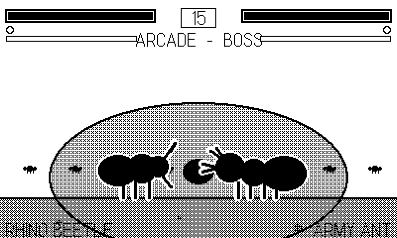

# The Case-Study Games {#sec-appendix-games}

The code quoted in this book's sidebars comes from real, shipped
Playdate games — roughly sixty of them, built by the author on the
house style this book teaches. This appendix is the cast list: what
each game is, and where and why the book quotes it. Source for the
published games lives in the
[github.com/plaidate](https://github.com/plaidate) organization; quotes
in the chapters carry `repo/path.lua:line` attributions so you can read
every excerpt in context.

The catalog is in two halves: the standalone games, then the five
*collections* — shared engines with a fleet of games on top — plus one
reusable module. Screenshots are the games' own repository
`screenshot.png` files, upscaled 2x nearest-neighbor like every other
figure in the book.

## Standalones

### Molt

An arkanoidvania: you are a crab, your carapace is the paddle, and a
bounced pearl smashes coral across a connected undersea world of 28
rooms, 6 zones, and 7 bosses. The largest game in the fleet, and the
book's favorite witness for "does this pattern survive contact with a
real game."

{#fig-cs-molt}

**Cited in:** @sec-lua-lab (the twenty-import `main.lua` that
demonstrates module-per-concern at scale), @sec-modes (the
`if/elseif` flavor of the mode machine, and the EMA update-cost
wrapper that feeds @sec-perf), @sec-sfx (fourteen all-synth voices in
one `sfx.lua`, zero audio files), @sec-music (its step-clock music
module), @sec-save (`save.lua` quoted as a complete file — the
nil-coalescing load pattern), and @sec-harness, where its 47-line
smoke harness is the direct ancestor of this book's own
(@sec-appendix-harness). Its full-game-beating autopilot — BFS
recovery, offset aiming, persistent boss wounds — is the existence
proof behind that chapter's claims.

### Blood and Whine

A mosquito continuing her bloodline: nectar to survive, blood to
breed, and every host can end you. A full procedural 1-bit art sweep
gave it the book's favorite dither lesson.

{#fig-cs-whine}

**Cited in:** @sec-dither — its `draw.lua` `gray(d)` helper, and the
scar behind that chapter's central warning: `setDitherPattern`'s
argument is *transparency*, not darkness (low = dark), a polarity
that cost this game an art pass.

### Fightin' Chitin

A one-on-one 2D fighting game starring the insect world's real
brawlers: two attack buttons, motion inputs, a crank-driven Frenzy
super, and a six-fighter archetype roster.

{#fig-cs-chitin}

**Cited in:** @sec-dither (HUD-versus-stage dither discipline in
`stage.lua`), @sec-crank (the character-select wheel in
`select.lua`), @sec-platformer (fighter AABBs in `fight.lua` — the
strict-inequality overlap test), and @sec-juice (KO hitstop: bodies
hang a beat before falling).

### Clam Jumper

An ocean-bed take on the 1982 arcade game *Claim Jumper*: pick sea
star, octopus, or ray — each with different verbs — against a rival
species in a connected coral maze.

{#fig-cs-clamjumper}

**Cited in:** @sec-input (its input module's snapshot shape) and
@sec-maze, where its `Util.pathNext` BFS — one flood fill shared by
the enemy AI *and* the autopilot — is the chapter's founding example
of "the bot is just another consumer of the game's own pathfinding."

### Weasel War Dance

A rhythm game about the mustelid family's greatest trick: the frenzied
"war dance" stoats and weasels really do perform. Eight mustelids,
small to large, dance to a clock-driven step sequencer.

{#fig-cs-weaselwardance}

**Cited in:** @sec-music, three times — its `conductor.lua` is the
book's reference implementation of the zero-drift step sequencer: a
clock that schedules notes by beat arithmetic rather than trusting
callbacks to arrive on time. A rhythm game is the genre least able to
tolerate drift, which is what makes its conductor the load-bearing
witness.

### Archer's Zoomie Circuit

*Wind up the whippet.* A one-button-and-crank racing game starring
the author's actual dog (who also, by seniority, supplied this book's
cover). **Cited in:** @sec-juice — notably as the only game in the
fleet built on `playdate.timer`, which is exactly why that chapter
trusts it for the timer coverage the other fifty-nine games skip.

### Bauble

A 1-bit color-matching bubble shooter: crank to aim, fire, pop
clusters of three or more. **Cited in:** @sec-modes — its
`gamestate.lua` documents the whole legal-mode enum in a comment at
the declaration, the convention the skeleton adopts.

### Bearing

A tilt-controlled marble maze: the accelerometer rolls a steel
bearing through a labyrinth, past holes, against the clock. **Cited
in:** @sec-tilt — accelerometer smoothing from its `main.lua`, the
difference between raw tilt (jittery) and playable tilt.

### The supporting bestiary

Five more standalones inform chapters without being quoted line by
line; their lessons arrived as design rules rather than excerpts:

- **Squirl** — a squirrel Metroidvania/parkour game; the Magic Acorn
  swaps you between six squirrel species, each a traversal key. Its
  full-game-beating autopilot (31 rooms, 6 bosses) is part of the
  evidence base for @sec-harness's claim that autopilots scale to
  whole games.
- **AnEnemy** — sea-anemone territorial warfare: crank-engorged
  acrorhagi, a feed-versus-fight economy, tides. Its four-strain
  campaign ships with a full-campaign autopilot in the same
  tradition.
- **Bin Night** — a tag-team trash heist (raccoon, ibis, cat versus
  the dawn garbage truck). Contributed the "summon what the test
  needs" autopilot style and heartbeat time-series tracing to the
  toolbox @sec-harness teaches.
- **Peckish** — a killdeer foraging the tideline: a wet-band worm
  economy behind receding waves, with the crank performing the
  broken-wing lure. A study in mapping one crank to one strong verb
  (@sec-crank's design rule).
- **Nectar Rush** — territorial-hummingbird feeder defense over a
  shared nectar pool; crank to sip. Its autopilot fails in *stages* —
  deliberately losing in controlled ways — a testing idea that
  resurfaces in @sec-harness.
- **Fairway** and **Roost** — top-down golf across
  larger-than-screen procedural holes, and an egg-gathering aerial
  lance-jousting arcade — round out the fleet, exercising the
  big-world camera patterns of @sec-camera and the flap-physics
  tuning habits of @sec-platformer respectively.

## The collections

Five repositories are not single games but engines with fleets on
top. When a chapter quotes `vec/` or `tiles/core/`, it is quoting
code that a dozen games run through every frame — the strongest
battle-testing in the catalog.

### Phosphor

Sixteen vector arcade games — white beam lines on black, the way the
cabinets drew them — on one thin shared library, `vec/`.

{#fig-cs-gyre}

**Cited in:** @sec-phosphor — an entire chapter walks the `vec/`
engine module by module (the mathematics, the code, and all sixteen
games) and is this collection's primary citation. Also @sec-images
(the `beams.lua` stroke font — text drawn as line segments, no
bitmaps), @sec-wireframe (its `mat.lua` rotation matrices,
`proj.lua` near-plane clipping, and `shapes.lua` asteroid
generation are that chapter's spine), @sec-crank (*Gyre*, the
collection's signature crank game — 1:1 angular control), @sec-juice
(the shared particle pool in `vec/fx.lua`), and @sec-save (the
cabinet-style shared attract mode and its high-score table in
`attract.lua`).

### Classics

Both volumes of *Code the Classics*, ported as original Lua
implementations sharing one core — a Pong, a Frogger, a Centipede, a
soccer game, a brawler, and more. Less quoted than lived-in: this
port marathon (nineteen games in one push) is where the headless
smoke-testing workflow was first hardened — the pcall-to-datastore
error trap, the `writeToFile` visual debugging, and the
asset-conversion checks that resurface across @sec-images,
@sec-harness, and @sec-appendix-setup.

### Voxel

Original 1-bit voxel games on one thin engine — a Voxatron-style
world of shaded columns in a 3/4 projection.

{#fig-cs-lob}

**Cited in:** @sec-voxel — an entire chapter walks the `core/`
engine module by module (the render-once background with exact
hidden-face culling, `Vox.carve`'s dirty-strip craters, the
occlusion ghost, both physics families, the shared aim solver, the
`Kit.run` cabinet, and all ten games) and is this collection's
primary citation. Also @sec-wireframe (the two-add 3/4 projection,
and the collection's design rule quoted there: *a voxel game must
use height and volume — dig, lob, climb, flood, fall — to earn the
engine*), @sec-crank (*Lob*'s wind-and-release crank mapping), and
@sec-maze (*Lob* again: area-of-effect tools must check for
friendlies, thrower included).

### Tiles

Original tile-and-sprite games built the way you would build for the
NES or Game Boy: a fixed 16px grid, a scrolling camera, and four
games (*Blast*, *Spirit*, *Relic*, *Burrow*) on the shared core.

{#fig-cs-blast}

**Cited in:** @sec-tiles — an entire chapter walks the `core/`
engine module by module (the tile-cache cost model, the physics,
the BFS field, the camera, and all four games) and is this
collection's primary citation. Also @sec-images (the fully
procedural tileset in `tmap.lua`: four games shipped without a
drawing tool ever being opened), @sec-camera (`tcam.lua`'s
follow-and-clamp camera and the pre-rendered background repaint
strategy), @sec-sfx (`tsnd.lua` noise sweeps), @sec-platformer
(`tphys.lua` — the fixed-DT tile physics and 1px substep at that
chapter's core, plus *Blast*'s walkable-bomb `isSolid` and
*Burrow*'s falling-boulder variant), and @sec-maze (*Blast*'s
radius checks). *Relic*'s save-versioning appears in @sec-save.

### Dither

The shade engine: dither ramps, dynamic lights, shadows,
transitions, and Super Scaler pseudo-3D on one core, with three
games that each *use* shade — *Sprint* (a Super Sprint-style racer
with day/dusk/night headlight racing), *Glim* (a firefly-keeper
whose lantern wick is the resource), and *Skimmer* (a Space
Harrier-lineage dragonfly over a pond).

{#fig-cs-glim}

**Cited in:** @sec-dither-engine — an entire chapter walks the
`core/` engine module by module (the 17-level Bayer/noise ramps,
the stencil-gated three-band light compositor and its `Light.at`
pixels-equal-logic query, shadows and Bayer transitions, the mip
ladders, depth queue, and perspective floor of the scaler, and all
three games) and is this collection's primary citation. It builds
directly on @sec-dither's dither-ladder foundations, and its
plane-cull war story is that chapter's ordering-dependency lesson.

## Modules

### midiplayer

Not a game: a reusable MIDI playback module (GM-lite patch bank,
track mapper, SMF generator) wrapped in a mixer-style demo app.
**Cited in:** @sec-music for the SDK-sequence side of the
sequences-versus-step-clocks argument — and, less gloriously, in
@sec-hello: its `tools/smoke.sh` carries the warning comment about
the SDK 3.0.6 Simulator launch form, the scar that protects every
build script in this book (@sec-appendix-setup).

## Reading the sources

Every plaidate repository follows the conventions this book teaches —
`source/` with module-per-concern files, a `Makefile`, a smoke-test
harness, a `screenshot.png` — so the skills transfer directly: pick
any game cited in a chapter you have just read, clone it, `make run`,
and find the quoted line. The fleet is the book's bibliography, and
unlike most bibliographies, it compiles.
