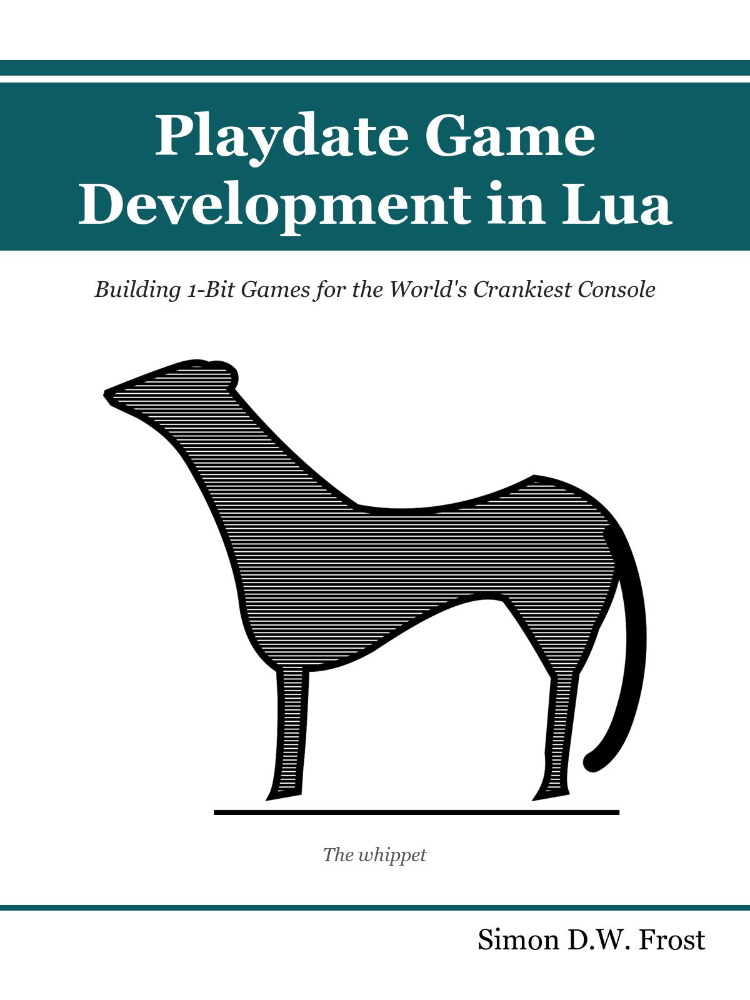

# Preface {.unnumbered}

{width=45% fig-align="center"}

This book teaches you to build games for the [Playdate](https://play.date)
— Panic's pocket-sized console with a 400x240 1-bit screen, a d-pad, two
buttons, and a hand crank — using the Lua SDK. It is a book about a small
machine, written in the belief that small machines are where game
programming is most fun: every constraint on this hardware — one bit of
color, a screen that tops out at 50 Hz (most games settle on the
recommended 30), a microcontroller's worth of CPU — turns
out to be a design prompt rather than a limitation, and the crank alone
has produced more original input ideas than a decade of extra buttons.

## Who this book is for

You are a competent programmer. You can read code in a language you have
not used before and see what it does; you know what a game loop is, even
if you have never written one. You have never touched a Playdate.
That is the whole prerequisite list. Lua itself gets a sixty-second
orientation in @sec-lua-lab and is gentle enough to absorb from the
listings; the Playdate-specific parts — and there are more of them than
you might expect, starting with a module system that shares one global
environment across every file — are the book's job to teach.

If you *have* shipped Playdate games, the book still has things to say
to you: a full treatment of the SDK systems most working codebases skip
(sprites, timers, the pathfinder), and a testing method — scripted
input, headless Simulator runs, autopilots that play the whole game —
that most Playdate developers have never seen applied to this platform.

## Why the Playdate

The Playdate is a fixed target: one screen, one CPU, one set of controls,
for every player in the world. There is no resolution detection, no
graphics-settings screen, no device matrix. You write a game; everyone
plays that game. The screen is a razor-sharp memory LCD where every
pixel is black or white — grays are an illusion you will learn to
manufacture from dither patterns in @sec-dither — and art made of two
colors is fast to produce, readable at arm's length, and impossible to
over-produce. The machine is honest about its budget (33 milliseconds a
frame at the recommended 30 fps, @sec-perf) and rewards discipline
rather than horsepower.

And then there is the crank: a fold-out handle that reports its absolute
angle, spins freely in both directions, and has no equivalent on any
other console. Games that use it well feel like they could not exist
anywhere else. It gets a chapter of its own (@sec-crank), with a catalog
of mappings proven across shipped games.

Constraints breed creativity. That is the sales pitch for the whole
console, and it is also the pedagogical bet of this book: on a machine
this small, you can hold the entire stack in your head — every pixel,
every millisecond, every byte of save data — and *that* is how game
programming is best learned.

## How the book is organized

Six parts, twenty chapters, five appendices:

- **Part I, Getting Started** takes you from an empty directory to a
  running program, then teaches the dialect of Lua this platform
  actually speaks and the update-loop-plus-mode-machine skeleton that
  every later example is built on.
- **Part II, Graphics** covers the 1-bit screen from primitives and
  dither patterns through images, fonts, the sprite system, cameras for
  worlds bigger than the screen, and wireframe fake-3D.
- **Part III, Input** works through the buttons, the crank, and the
  accelerometer — plus the system menu, pause screen, and the other UI
  the OS expects you to respect.
- **Part IV, Sound** builds effects from raw synthesizers and music
  from sequences and step clocks, with no audio files in sight.
- **Part V, Building Games** assembles the game-shaped parts: movement
  and collision, game feel, enemies and pathfinding, and saving.
- **Part VI, Shipping** is the payoff: testing your game without
  touching it, making it fast on real hardware, and packaging a
  finished, polished pdx for other people's devices.

The appendices are references: Playdate Lua versus standard Lua, a map
of the full SDK by namespace, environment setup (including the
unattended-Simulator configuration the book's own tooling depends on),
the book's test-and-figure harness documented for reuse, and a catalog
of the shipped games quoted throughout.

## How the examples work

Every chapter has a companion example: a real, buildable Playdate
project living in `examples/NN-slug/` alongside the book's source. Each
one compiles with the SDK's `pdc`, runs in the Simulator, runs on a
device, and is small enough to read in one sitting. To play any of
them:

```bash
make -C examples/03-modes run
```

That builds a clean pdx and opens it in the Simulator. The examples are
not illustrative fragments — they are the source of truth for the
book's listings, which are extracted from the example sources at render
time and therefore cannot drift from the code that actually ships.

The figures go one step further. Every screenshot in this book was
captured *automatically*, by scripting the example with synthetic input
from a fixed random seed and photographing named frames of the run.
When a caption says "frame 200 of a deterministic run," that is a
literal description of how the PNG was made — rebuild the book and the
same pixels come back. Reproducibility is a feature here, not a
flourish: the capture pipeline doubles as a smoke test (a crashing
example fails the build before it can produce a stale figure), and by
@sec-harness you will have learned to build the same machinery for your
own games. The scaffolding that makes this work rides along in every
example as two small files, `shots.lua` and `bookharness.lua`,
introduced honestly in @sec-hello and documented in full in
@sec-appendix-harness.

## What you need

- **A computer.** macOS, Windows, or Linux — the SDK supports all
  three. This book's examples and tooling were built on macOS; the
  handful of macOS-specific details are flagged as such.
- **The Playdate SDK**, a free download from Panic. It includes the
  compiler, the Simulator, the libraries, and the API reference. This
  book was written against SDK 3.0.6. @sec-appendix-setup covers
  installation end to end.
- **A Playdate — optional.** The Simulator is a faithful development
  rig and everything in this book can be done without hardware. But the
  Simulator runs on a desktop CPU that is enormously faster than the
  device, so before you *ship*, you want real hardware in your hands
  (@sec-perf returns to this, with numbers).

## Where the patterns come from

The advice in this book is not speculative. It is distilled from
roughly sixty shipped Playdate games by the author — vector arcade
games, tile-engine platformers, a voxel engine, a 28-room
metroidvania, rhythm games, fighting games, and a bestiary of
small animal-shaped originals — all built in Lua, on one consistent
house style, with a shared testing discipline. When a chapter
recommends a pattern, the recommendation usually arrives with a scar:
the game where the alternative was tried, what broke, and what the
pattern fixed. The games themselves appear throughout as case-study
sidebars, and @sec-appendix-games catalogs them; the source for most
is public at [github.com/plaidate](https://github.com/plaidate).

## Conventions

- Code listings carry a filename chip showing which example source file
  they were extracted from. If a listing has no filename, it is either
  a deliberate anti-pattern (the prose will say so) or a quote from a
  shipped game.
- Quotes from the shipped games carry their origin as a first-line
  comment, `-- repo/path/file.lua:line`, so every claim about "how the
  real games do it" is checkable against real code.
- Callout boxes mark the traps (warnings) and the asides (notes). The
  warnings are all load-bearing; each one cost somebody an afternoon.
- API names are verified against the SDK 3.0.6 reference, *Inside
  Playdate* — which ships with the SDK and remains the authority on
  every optional argument this book does not spell out.

## Acknowledgments

Panic's *Inside Playdate* documentation deserves particular thanks: it
is that rare platform reference that is accurate, complete, and a
pleasure to read, and this book leans on it throughout. Thanks also to
the Playdate community, whose collective curiosity about what a crank
is for keeps this platform delightful — and to Archer, the whippet on
the cover, who insisted.

## License {.unnumbered}

The text and figures of this book are licensed under [Creative Commons
Attribution 4.0](https://creativecommons.org/licenses/by/4.0/) (CC BY
4.0); the example projects, tooling, and every code listing are under
the [MIT License](https://github.com/plaidate/playdate-book/blob/main/LICENSE).
Playdate is a registered trademark of [Panic Inc.](https://panic.com);
this book is not affiliated with or endorsed by Panic.
